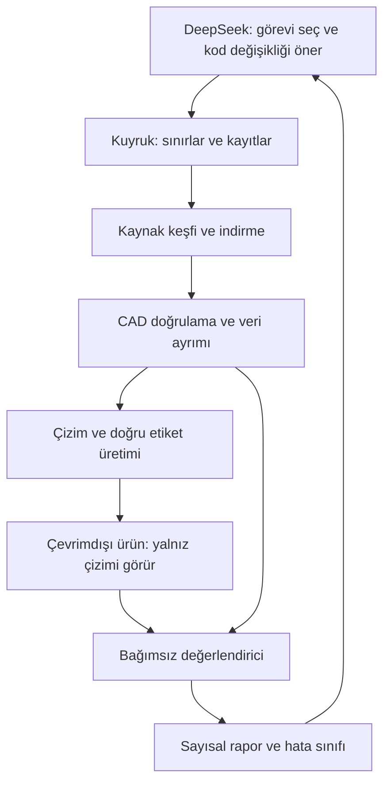

# DrawingTo3D deney sistemi — uygulama şartnamesi

Tarih: 2026-09-29. **Durum: mimari referans; koşucu/değerlendirici kısmen uygulandı, kabulü açık.** Güncel bulgular ve devam noktası [yedinci ilerleme denetiminde](HERMES_PROGRESS_REVIEW_7_20260930.md); aşağıdaki başlangıç envanteri tarihseldir.

**Güncel uygulama sırası, RunPod bütçesi ve M1 kabulü [HERMES_IMPLEMENTATION_PLAN.md](HERMES_IMPLEMENTATION_PLAN.md) içindedir.** Kullanıcı bulut eğitimini ve toplam 20 USD hizmet bütçesini kabul etti; ilk teknik deneme 3 USD. Buradaki L00–L07 tablosu önceki tasarımın tarihsel görev haritasıdır, yeni iş sırası değildir. Güncel iş H04 X01–X05 ürün kabulü ve güvenilir deney akışıdır; eski onarımlar korunur. Aşağıdaki sonlu ilk teslim ve üç tur anlatıları tarihseldir; güncel goal ara raporda durmaz, tanımlı ürün başarısına kadar sürer. Üç deneme aynı hipotezi değiştirme eşiğidir.

Kullanıcının kararı: DeepSeek kodu geliştiren ve deneyleri yöneten asistandır. Son ürün kurulumdan sonra M1 / 16 GB üzerinde çevrimdışı çalışır. Veri bulma ve indirme aşaması internet kullanabilir. Bu belge model eğitiminin başarılı olduğunu veya her çizimin otomatik çözülebileceğini iddia etmez.

## 1. Sonlu ilk teslim

Bir yeni geliştirme parçasında **kaynak → doğrulanmış CAD → ölçülendirilmiş çizim → mevcut ürün → ayrı değerlendirme → rapor** akışını çalıştır. Parçanın doğru üretilmesi şart değildir; doğru başarısızlık sınıfı ve eksiksiz kanıt da ilk altyapı tesliminin geçerli sonucudur. Ürün doğruluğu ayrı ölçülür.

Sonra aynı mekanizmayı ilk etapta en fazla 10 geliştirme parçasına uygula. Bu sayı doğruluk iddiası için yeterli test büyüklüğü değildir. PLAN.md'deki bağımsız pilot ve saklı değerlendirme hedefleri ayrıca geçerlidir. Eğitim bu ilk teslimin önkoşulu değildir.

## 2. Mevcut durum: kaynak incelemesi

2026-09-29 tarihinde incelendi; bu belgeyi hazırlarken ürün testleri yeniden çalıştırılmadı.

| Bileşen | Var olan | Eksik / dikkat |
|---|---|---|
| Ürün | `src/drawingto3d/` içinde okuma, ölçü bağlama, guided kararları ve CAD üretimi | PLAN.md'deki açık kabul koşulları devam eder |
| Deney araçları | `eval/frontend.py`, `model_baseline.py`, `guided_effort.py` | Yeni korpusu alan ortak adaptör, kuyruk ve devam etme mekanizması |
| CAD kontrolü | `eval/metrics.py` | Delik adedi, merkez, eksen, derinlik ve eksik/fazla özellikler için yeterli değil |
| Veri | `eval/cases.json`: 11 kayıt, 10 `part_group`; 7 seen-regression, 4 unassigned kayıt | `pilot` ve `hidden` boş; `_counts` açıklaması kayıtlarla uyuşmuyor |
| Devir | PLAN.md, HANDOFF.md ve eski HERMES_PROMPT.md | Eski talimatlarla güncel durum tablosu çelişebiliyor; kaynak ve ilgili kanıtla doğrula |
| GrabCAD | Kullanıcı kişisel kullanım için indirmeye izin verdi; Roller Bracket aday sayfası görüldü | Bu çalışma kapsamında yerel dosyası ve CAD bütünlüğü doğrulanmış bir indirme yok |

`metrics.py` dış boyutları sıralar; 1 mm veya %2 boyut, %25 hacim ve 0,5 mm yarıçap toleransı kullanır. Silindir yarıçaplarını kümeye dönüştürür: eş yarıçaplı deliklerin sayısını kaybeder. Fazla yarıçapları raporlar fakat bunları başarısızlık şartına katmaz. Bu sonuç **tam parça doğruluğu** olarak adlandırılmamalıdır.

## 3. Görev dağılımı



DeepSeek'e dosya, terminal ve tarayıcı araçları sağlayan bir ajan ortamı gerekir. Sadece sohbet modeli veri indiremez veya test çalıştıramaz. Ajanın her şeyi aynı anda hatırlamasını bekleme: tek aktif görev, sürümlü giriş/çıkış ve dosyada kalıcı durum kullan.

Geometri, ölçü üretimi, doğrulama ve puan hesaplaması deterministik kodla yapılır. DeepSeek hata kümelerini inceler, bir hipotez seçer, kod düzeltir ve yeniden deneyi ister. Başarı kararını serbest metinle kendisi yazmaz. Ürün içine DeepSeek API bağımlılığı eklenmez.

## 4. Veri edinme ve doğru örnek üretme

Kaynak adaptörleri iki giriş kabul etsin: izin verilen çevrimiçi kaynak ve yerel dosya klasörü. Başlangıçta STEP tercih edilir. STL tek başına parametrik özellik geçmişi veya doğru mühendislik ölçüleri sağlamaz. Desteklenmeyen montajlar tek parça gibi değerlendirilmez; açık kapsam etiketiyle ayrılır.

Her kayıtta kaynak sayfası, yazar, erişim tarihi, kullanım koşulu kaynağı, format, dosya boyutu, SHA-256 ve edinme yöntemi tutulur. Kullanıcının ticari olmayan kullanım tercihi site kısıtlarını kaldırdığı şeklinde yorumlanmaz. Erişim engeli/CAPTCHA varsa o iş beklemeye alınır; yerel giriş ve izinli kaynaklarla diğer işler sürebilir. Toplu tarama, sitenin izin verdiği erişim yöntemiyle sınırlıdır.

İndirilen arşivler boyut, dosya sayısı ve dizin dışına çıkma kontrollerinden geçirilir; içindeki makro veya scriptler çalıştırılmaz. İçe aktarma süre sınırı olan ayrı süreçte yapılır. Bozuk, birimi bilinmeyen veya desteklenmeyen CAD gerekçesiyle karantinaya alınır. Birim uydurulmaz. Ham dosya değişmez; normalize edilmiş türev ayrı kaydedilir.

**CAD dosyası tek başına çizim okuma eğitim örneği değildir.** İki yol gerekir:

- Gerçek çizim + ona ait CAD varsa eşleşme doğrulanır; etikette yalnız çizimin desteklediği ölçüler bulunur.
- Yalnız CAD varsa program görünüşleri, gerekli kesitleri ve ölçüleri üretir. Her ölçünün sayısal değeri, birimi, bağlı geometrisi, ok uçları ve görünüşü etiketlenir. Tek başına gölgeli render veya ölçüsüz izdüşüm yeterli değildir. İlk üreteç desteklediği parçaları açıkça sınırlar; başka geometriyi sessizce atmaz.

Üç boyutlu CAD'den özgün tasarım işlem geçmişi her zaman geri çıkarılamaz. İlk hedef özellik/ölçü etiketleri ve geometrik eşdeğerliktir. İşlem dizisi eğitimi istenirse ayrıca doğrulanmış kanonik işlem planları veya işlem geçmişi bilinen parametrik üreteç gerekir.

Üretilen çizimlerin okunabilirliği, ölçü çakışmaları ve etiket/ok eşleşmesi kontrol edilir. Sentetik çizimde başarı, gerçek teknik paftada başarı sayılmaz; gerçek çizimler ayrı raporlanır.

## 5. Ayrım ve bağımsız doğruluk

Parça kimliği, köken ve geometrik benzerlikle kopyaları grupla. Ayrımı **rasterleştirme, döndürme, gürültü ve parametre varyantı üretmeden önce** yap. Aynı temel parça/üreteç ailesi eğitim ve bağımsız test taraflarına dağılmasın. SHA-256 yalnız bayt kopyasını bulur; yeniden dışa aktarılmış aynı şekli tek başına yakalayamaz.

`examples/pdf with steps` ve mevcut eval örnekleri eğitim kaynağı değildir. İncelenmiş veya düzeltmede kullanılmış örnekler regresyondur. `unassigned` saklı test değildir. Kaynağı tararken ayrıntısı incelenen parçayı da saklı başarı kanıtı yapma.

Ürün sürecine yalnız çizim ve ürünün normal girişleri verilir. Referans CAD, doğru etiketler ve ideal plan yalnız veri üretme/değerlendirme tarafındadır. Dosya adı ve parça kimliği cevap olarak kullanılamaz. Eğitim verisi etiketleri yalnız eğitim işi tarafından okunabilir; test referansları eğitimden uzaktır.

Değerlendirici en az şunları ayrı verir:

1. Okunan her ölçü: değer, birim, Ø/R ayrımı, hangi geometrilere bağlı olduğu; eksik ve uydurulmuş ölçüler.
2. CAD: yeniden açılma, geçerli katı, beklenen katı sayısı, birim ve koordinat hizalama bilgisi.
3. Desteklenen özellikler: delik/cep adedi, merkez/eksen, çap/yarıçap, derinlik; eksik ve fazla özellik.
4. Sayısal ölçü hataları; toleranslar deney öncesi tanımlanır, sonuç kötü diye gevşetilmez. Çizimdeki tolerans ile sayısal CAD toleransı ayrı tutulur.
5. Ek şekil farkı: ortak referans çerçevesinde hacim farkı/mesafe ve görünüş karşılaştırması. Bunlar özellik kontrolünün yerine geçmez. Genel yüz sayısı B-rep eşdeğerliğinin zorunlu ölçüsü değildir.
6. Otomatik başarı, kullanıcı yardımıyla başarı, müdahale sayısı, süre, bellek ve swap ayrı raporlanır. Ajanın referansa bakarak kullanıcı kararlarını doldurması otomatik ürün başarısı değildir.

Çizimde belirtilmeyen bir ayrıntı için referansın keyfi değerini zorunlu doğru cevap yapma. Belirsizlik açık raporlanır; ürün ölçü uydurmak yerine eksik bilgiyi sorar. `pass`, `fail`, `needs_input`, `unsupported`, `timeout`, `error`, `not_evaluated` ayrı sonuçlardır. Eksik kontrol pass değildir.

Önce değerlendiricinin yanlış parçaları yakaladığını kanıtla: aynı yarıçaplı deliği ekle/çıkar, merkezi kaydır, kör deliğin derinliğini değiştir, birimi değiştir; bunlar başarısız olmalı. Yalnız dosyanın tekrar dışa aktarılması gibi eşdeğer değişiklikler başarılı kalmalı.

Aynı deneyde değerlendirici ve test manifesti sürümü sabittir. Değerlendirici düzeltmesi ayrı değişiklik ve eski/yeni sonuçları yeniden hesaplama gerektirir. Gerçek erişim ayrımı için saklı veri ve değerlendirme kodu ajan yazma alanının dışında, salt okunur değerlendirme sürecinde tutulmalıdır. Aynı yazılabilir repoda hash veya “değiştirme” talimatı tek başına koruma sağlamaz. Bu izolasyon yoksa sonuç geliştirme ölçümüdür; bağımsız saklı test iddiası kurulmaz.

## 6. Orkestratör sözleşmesi — kısmen uygulandı, kabulü açık

Önerilen giriş `python -m drawingto3d_lab` ve komutlar `status`, `next`, `run`, `resume`, `report`. **Bunlar şu anda mevcut komutlar değildir.** Yeni modül ürün paketinden ayrı tutulur; mevcut eval işlevlerini adaptörle çağırır.

SQLite veya atomik yazılan durum dosyasıyla şu zinciri tut:

`discovered → acquired → validated → split_assigned → prepared → inferred → evaluated → reported`

Her aşamadan `failed`, `quarantined` veya `needs_input` sonucu çıkabilir. İşler `queued/running/done` yürütme durumunu ayrıca taşır; işin bitmesi ürünün doğru olduğu anlamına gelmez. Girdi hash'i, araç/sürüm ve ayarlar idempotency anahtarıdır. Yarım çıktı geçerli çıktı sayılmaz; yeniden başlatma bitmiş işi tekrar indirmez. Birden çok süreç aynı işi alamaz.

Önerilen ilk pilot sınırları: aynı anda 1 ağır CAD/model işi, en fazla 10 parça, 2 indirme denemesi, vaka başına 10 dakika ve toplam 2 saat. Bunlar başarı garantisi değil başlangıç ayarlarıdır; her çalıştırmanın manifestinde açık değerleri bulunur. İndirilecek/açılacak toplam bayt, dosya sayısı, boş disk ve bellek/swap sınırları da tanımlanmadan gözetimsiz iş başlatılmaz. İlk kuru çalışma ağ/indirme/eğitim yapmadan planlanan işi gösterir.

Her çalıştırma tekil `run_id` klasörü üretir: `manifest.json`, `events.jsonl`, `results.json`, `report.md` ve çıktı dosyaları. Kayıt: zaman, kod commit'i **ve kirli değişikliklerin özeti/patch hash'i**, veri/evaluator/model/prompt sürümü, komutlar, çıkış kodları, vaka durumları, kaynak tüketimi ve bütün dosya hash'leri. Komutun 0 dönmesi tek başına başarı değildir: mevcut araçların JSON sonucunu ayrıştır.

Raporda toplam aday, indirilen, elenen, çalıştırılan, başarısız ve değerlendirilmeyen örnekler görünür. Toplam ürün denemeleri üzerinden otomatik başarı ve desteklenen kapsam üzerindeki başarı ayrı verilir; `needs_input`/timeout saklanmaz. Payda her yüzdede görünür. Az örneklem genel doğruluk iddiasına dönüştürülmez.

## 7. Önceki görev haritası — tarihsel referans

Eski sıra L00 → L01 → L02 → L03 → L04 → L05 → L06 idi. Yeni uygulama planı H00–H11 kullanır ve bağımsız değerlendiriciyi önceye alır. Aşağıdaki tablo bileşenlerin kökenini korur; başlangıç talimatı olarak kullanılmaz.

| İş | Teslim | Kapanış kanıtı |
|---|---|---|
| L00 | Güncel kaynak ve mevcut komutların kısa kontrolü | `out/lab/bootstrap.json`: durum, kirli dosyalar, ortamlar, mevcut/eksik araçlar; eski belge iddiasıyla kodun farkı |
| L01 | İş kayıtları, sınırlar, `status/next/run/resume/report` | Süreç ortada kesilip yeniden başlatılınca bitmiş işler yinelenmez; bozuk sonuç ve timeout başarı yazılmaz |
| L02 | Yerel CAD girişi + kaynak adaptörü + doğrulama | Bir yeni CAD için kaynak/hash/birim/katı kaydı; bozuk arşiv ve tekrar eden dosya doğru ele alınır; ağ engeli yerel yolu durdurmaz |
| L03 | Daha güçlü, sürümlü değerlendirici | Yukarıdaki yanlış delik, konum, derinlik, birim karşı örnekleri reddedilir; doğru eşdeğer parça geçer |
| L04 | Sınırlı ama açık kapsamlı çizim ve etiket üreteci | Ölçü/ok/özellik eşleşmesi doğrulanmış bir yeni örnek; desteklenmeyen parçanın eksik çizimi geçerli sayılmaz |
| L05 | Yeni manifest adaptörü ve gerçek ürün yolu | Tek yeni çizimden ürün çalışır; referans ürün girişine girmez; bağımsız ölçüm ve hata sınıfı raporlanır |
| L06 | Sınırları olan geliştirme döngüsü | Bir hata hipotezi → küçük düzeltme → ilgili regresyon + aynı pilot; en fazla 3 düzeltme turu; başarısızlık ve gerilemeler korunur |
| L07 | Yalnız ölçüm gerekçelendirirse küçük yerel model deneyi | Eğitim öncesi/sonrası aynı bağımsız geliştirme ölçümü; M1 bellek ve süre kaydı; daha iyi değilse başarısız deney olarak saklanır |

L06 ürünün genel doğruluk açığını gerekli yerde düzeltir; mevcut PLAN.md kabul koşullarını baypas etmez. Saklı test, tekrar tekrar hata ayıklama amacıyla sorgulanmaz. Son değerlendirmede ayrı kapsam ve sınırlı geri bildirim kullanılır; ayrıntısı açılan vaka sonraki geliştirmelerde regresyona taşınır.

## 8. M1 ve eğitim kararı

Veri hazırlama ve sırayla çalışan test/raporlama, büyük bir modeli baştan eğitmeyi gerektirmez. Gerçek CAD karmaşıklığına göre bellek ve hız yine ölçülür. İlk karşılaştırma mevcut modelsiz yol ile mevcut yerel model yoludur. Sorun hatalı geometri çözücüsüyse eğitim bunu onarmış sayılmaz.

Hata analizi hedefi göstermeden LoRA başlatma. Gerekirse küçük bir görsel modelde ölçü okuma veya ölçü–geometri eşleştirme gibi dar bir görev seç. Güncel karara göre eğitim RunPod'da yapılabilir; önce M1 inference ve export uyumluluğu sınanır. İlk bulut koşusunda forward/backward ve checkpoint geri yükleme doğrulanır, sonra model Mac'e indirilir. M1 / 16 GB'ta hız ve doğruluk garanti değildir. Toplam 20 USD, ilk aşama 3 USD bütçe ve kaynak kapanış kuralları ana uygulama planındadır. Fiziksel GPU satın alma veya ücretli öğretmen model bu ilk deneyin kapsamında değildir.

## 9. Var olan komutlar

Kök dizinde çalıştırılır. Örnek etiketler her çalıştırmada yenilenmeli; önceki sonuçların üzerine yazılmamalıdır. Bunlar kaynakta mevcut komutlardır; bu devir hazırlanırken çalıştırılmış başarı sonuçları değildir.

```bash
PYTHONPATH=src .venv/bin/python eval/model_baseline.py --no-model --conditions reading,chain,verified_plan --label lab-baseline-UNIQUE
PYTHONPATH=src .venv/bin/python eval/guided_effort.py --drawing "PATH_TO_DRAWING" --accept-and-build --label lab-guided-UNIQUE
.venv-cad/bin/python eval/metrics.py "PRODUCED.step" "REFERENCE.step"
```

İlk komut mevcut manifesti kullanır; yeni korpus adaptörü L05 işidir. `verified_plan` doğru plan verildiğinde derleyici tanısıdır; uçtan uca otomatik çizim okuma başarısı değildir. `--accept-and-build` mevcut önerileri onaylar, eksik bilgiyi çözmez. Son komut yalnız mevcut zayıf ölçümdür, L03 yerine geçmez. build123d ile CadQuery farklı OCC bağımlılıkları nedeniyle ayrı Python ortamlarında tutulur.

Güncel devam noktası: [HERMES_PROMPT.md](../HERMES_PROMPT.md) ile X01–X05, yeni dört-vaka ölçümü ve gerçek M1 ürün kabulü; eski kapalı işler tekrarlanmaz. Ara checkpoint bitiş değildir. H00 kaydını yeniden kurma. Sadece bu belgeyi yeniden özetlemek uygulama teslimi sayılmaz.
