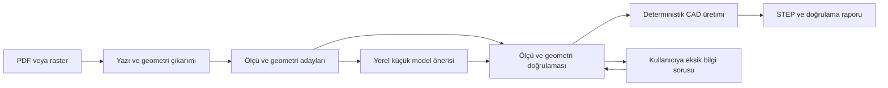

# Hermes uygulama planı: bulutta eğitim, M1'de çevrimdışı DrawingTo3D

Sürüm: 8 — 2026-09-30 ilerleme denetimi. Çalışma dizini: `/Users/aydemir/Desktop/drawingto3d`.

**Güncel durum: değerlendirici ve koşucu kısmen uygulandı; kabulü açık. Dört sentetik v2 parça mevcut; önceki etiket hataları düzeltildi, ölçü okuma/ankraj ve deney raporlama açıkları sürüyor. Eğitim ve M1 model kabulü henüz kanıtlanmış değil.**

## 0. Güncel devam sırası — yedinci denetim

[Yedinci denetim](HERMES_PROGRESS_REVIEW_7_20260930.md), [goal](../HERMES_PROMPT.md): HEAD b1aec25;70 ilgili test geçti. Tanık ölçeği ve hedefli sorular uygulanmış. offline-flow dört yanlış bbox'lı STEP'e accepted=true verildiğini gösteriyor; araç geometrik cevaplarla bütün kayıtları user yapıyor ve yarıçapı çap diye raporluyor. Gerçek otomatik/UI kabulü değildir.

Sıra X01 ürün kabulü → X02 gerçek/simüle kullanıcı ayrımı → X03 mevcut özellik evaluator'ı ve X04 mevcut runner entegrasyonu → taze dört-vaka baseline → X05 callout/leader/rol/datum → gerçek UI/store ve P01–P08. Yakındaki daire tek başına delik kanıtı veya bağımsız ölçek tanığı değildir. Önceki kapanmış işleri yeniden yapma.

Başarıya kadar devam sözleşmesi aynen korunur: dört sabit vaka, ilk destek kapsamı ve20 yeni/en az10 raster final set, doğru geometri ve yanlış onayın önlenmesi, M1 çevrimdışı gerçek ürün. Ara rapor, retlerin artması veya testlerin geçmesi goal sonu değildir. Üç başarısız denemede hipotezi değiştir. Tek ağır iş/vaka600s/koşu7200s; ilkRunPod3USD/toplam20USD ve sonraki ücretli aşama için kullanıcı değerlendirmesi korunur. Eğitim hâlâ koşulludur.

## 1. Kullanıcının kararları ve okuma sırası

- Son ürün M1 / 16 GB üzerinde, kurulumdan sonra çevrimdışı çalışacak. Girdi PDF/PNG/JPG; çıktı doğrulanmış STEP, açıklanmış belirsizlikler ve gerektiğinde çizim üzerinde kullanıcı düzeltmesi.
- DeepSeek, Hermes içindeki kod geliştirme ve deney yönetimi asistanıdır. Ürün çalışma anında DeepSeek veya RunPod'a bağlanmayacak.
- Gerekçelendirilen küçük model eğitimi RunPod GPU Pod üzerinde yapılabilir. Yeni fiziksel GPU alınması gerekmiyor. Genel bir modeli sıfırdan eğitmek, büyük öğretmen modeli eğitmek ve distillation ilk deneyin kapsamı değil.
- Kabul edilen RunPod hizmet bütçesi toplam **20 USD**: ilk teknik deneme **en fazla 3 USD**, küçük eğitim/değerlendirme **12 USD**, depolama ve aksaklık payı **5 USD**. DeepSeek API kullanımı ve varsa vergiler bu hizmet bütçesinin dışında; ayrı raporlanır. Bütçe eğitimin işe yarayacağına dair garanti değil.
- İlk 3 USD aşamasının raporu kullanıcıya sunulacak; sonraki ücretli eğitim o rapor değerlendirildikten sonra başlayacak. Yerel ve ücretsiz bağımsız işlerde her adım için tekrar izin istenmez.
- Kullanıcı GrabCAD'den kişisel, ticari olmayan kullanım için indirmeye izin verdi. Her dosyanın kaynak/kullanım kaydı tutulacak; kaynak erişim kuralları korunacak.

Hermes önce bu planı ve [görev kuyruğunu](hermes-task-queue.json), ardından [PLAN.md](../PLAN.md) içindeki değişmez kuralları ve güncel durum tablosunu okumalı. Bu belge **yeni deney/eğitim iş sırasını** belirler; PLAN.md'nin ürün doğruluğu kabul koşullarını iptal etmez. Eski A0/P01/P04 anlatılarında durum çelişkileri var: ilgili kaynak ve test kanıtını kontrol et, tamamlanmış işi baştan yazma.

Başlangıç istemi [HERMES_PROMPT.md](../HERMES_PROMPT.md). Önceki istem [arşivde](HERMES_PROMPT_BEFORE_CLOUD_20260929.md). `DEEPSEEK_PROMPT.md` aynı yeni girişe yönlenir. Önceki otomasyon belgesindeki L00–L07 sırası yerini buradaki H00–H11'e bırakır.

## 2. Tarihsel başlangıç durumu (ilk plan öncesi)

Bu satırlar 2026-09-29 kaynak incelemesidir; eski test başarılarını yeni çalıştırılmış gibi kullanma.

| Konu | Kanıt / sınır |
|---|---|
| Çalışma ağacı | Commit `b68af774a487dc5984d5c61c8f490a625bd3b065` üzerinde kullanıcının kaydedilmemiş kod/test/belge değişiklikleri var; koru |
| Ürün | `observe`, `raster`, `bind`, `meaning`, `proposal`, `planner`, `guided`, `sketch_constraints`, `general` modülleri mevcut |
| Model yolu | `llama.py` yerel Ollama/llama-server istemcileri içeriyor. Yeni MLX desteği ayrı adaptör gerektirebilir; mevcut modele otomatik geçiş yapma |
| Python/CAD | Ürün Python 3.12 ve build123d; CadQuery değerlendirmesi farklı OCC bağımlılığı nedeniyle `.venv-cad` içinde |
| Değerlendirme | `eval/metrics.py` sıralanmış dış boyutlar, hacim ve tekil silindir yarıçapları kullanıyor. Delik sayısı, konum ve derinliği yeterince sınamıyor; fazla yarıçapları başarısızlık saymıyor |
| Veri | `eval/cases.json` içinde 11 kayıt / 10 parça grubu; 7 seen-regression ve 4 unassigned kayıt. Pilot/hidden listeleri boş. `_counts` metni güncel kayıtlardan farklı |
| GrabCAD | Roller Bracket aday sayfası görüldü; bu oturumun kanıtında yerel CAD doğrulaması tamamlanmış değil. Gizli test için uygun aday sayılmaz |
| RunPod MCP | Kullanıcının ilettiği Hermes raporuna göre doğrulanmış; rapor anında pod/cluster/endpoint listeleri boş. Bu, kalıcı güncel hesap envanteri değildir |
| Anahtar | Kullanıcı API key'i ayarladığını bildirdi. Değerini okumadan/yazdırmadan yetkili çağrıyla doğrula |
| Yerel CLI | `/Users/aydemir/.local/bin/runpodctl`, sürüm `2.14.0-dd55bcf` görüldü. `flash` bulunmadı; bu Pod eğitimi için zorunlu değil |
| Önemli CLI farkı | Bu sürümün `pod create --help` / `pod update --help` çıktısında `--terminate-after` yok. Rehberdeki bu bayrağı mevcutmuş gibi kullanma |

## 3. Ürün mimarisi



Vektör PDF'nin metin/çizgi bilgisi önce doğrudan okunur; raster girdide OCR/CV kullanılır. Model yalnız seçilen dar görev için devreye girer. Sayfadaki ilişkileri koruyan bir bağlam görünümüyle ilgili yüksek çözünürlüklü bölgeleri kullan; ince ölçüleri kaybedecek şekilde bütün paftayı küçültme, görünüş ilişkilerini kaybedecek şekilde körlemesine bölme.

Model çıktısı sürümlü veridir. Mevcut `GeneralPlan`, kaynak span kimlikleri, birimler ve kısıt kontrolleri yeniden kullanılır. İlk eğitim hedefi doğrudan serbest Python/CAD kodu üretmek değildir. Eski deneysel kod üretme yollarını yeni modelin varsayılan ürün yolu yapma.

Temel ilkeler:

1. Çizimdeki değer, birim, geometri bağlantısı ve kanıtı birbirinden ayrılmaz. Model güven puanı tek başına doğrulama değildir.
2. Referans STEP veya doğru cevap ürün girişine, modele, önericiye ve kullanıcı kararlarını otomatik doldurmaya giremez.
3. Eksik ölçü, desteklenmeyen işlem veya çelişki varsa açıklanmış ret/soru üretilir. Piksel tahmini kesin mühendislik ölçüsü diye sunulmaz.
4. Dosya adı, örnek numarası, bilinen koordinat veya sabit delik adediyle özel çözüm yok. Mevcut test örnekleri eğitim verisi olamaz.
5. Aynı CAD'in farklı B-rep temsilleri eşdeğer olabilir; salt yüz sayısı veya dosya bayt eşitliği doğruluk ölçüsü değildir.
6. Toleranslı nominal ölçü doğruluğu ile GD&T/imalat uygunluğu ayrı kapsamlardır. GD&T çözülmediyse açıkça `unsupported` yaz; STEP üretildi diye imalat onayı verme.

## 4. Aşamalar ve hedef teslimler

Her aşama küçük, kanıtlanabilir bir teslimdir. Durumlar `pending`, `running`, `verified`, `needs_input`, `blocked`, `not_required`. Dosyaların varlığı ve test sonucu birlikte kaydedilir. Bir işin tamamlanması, ürünün doğru parça üretmesiyle aynı durum değildir.

| Aşama | İş | Bağımlılık | Ücret |
|---|---|---|---|
| H00 | Kısa mevcut durum kaydı ve bağlantı kontrolü | — | Kaynak oluşturmaz |
| H01 | Yanlış parçayı yakalayan değerlendirici | H00 | Yerel |
| H02 | Küçük, devam edebilen deney koşucusu | H01 | Yerel |
| H03 | Korpus girişi, etiket ve veri ayrımı | H02 | Yerel; izinli indirmeler |
| H04 | Mevcut performans ve hata katmanı raporu | H03 | Yerel |
| H05 | Dar görev seçimi ve M1 model karşılaştırması | H04 | Yerel |
| H06 | Eğitim paketi ve bulut ön kontrolü | H05 | Yerel / salt okunur API |
| H07 | İlk bulut eğitim denemesi | H06 ve bütçe koruması | İlk 3 USD sınırında |
| H08 | Çıktıyı M1'de aç, değerlendir, kaynakları kapat | H07 | İlk aşamanın aynı 3 USD sınırı |
| H09 | Küçük asıl eğitim deneyi | H08 ve kullanıcının ilk raporu değerlendirmesi | En fazla 12 USD; toplam 20 USD |
| H10 | Eğitilmiş modeli M1'e entegre et / adayı reddet | H09 | Yerel |
| H11 | Son değerlendirme, paketleme ve maliyet kapanışı | H10 | Yerel; kalan depolamayı kapat |

Güncel goal bölüm 0’daki ürün başarı sözleşmesinde biter; H00–H11 ara aşamalardır. Eğitim gerekmezse eğitim aşamaları gerekçeli not_required olur; H11 ürün kabulü yine zorunludur. H04/H05 eğitimin doğru müdahale olmadığını gösterirse harcama yapmadan kanıtlı `training_not_justified` raporu üret; bu deneyin geçerli sonucu olabilir. Genel ürün hedefini tamamlandı ilan etme.

### H00 — Başlangıç, en fazla bir kısa inceleme turu

Yapılacaklar:

- Geçerli AGENTS.md varsa oku. `git status`, HEAD, ilgili kirli dosyaların içerik hash'leri, çalışma ortamı sürümleri, mevcut araç/komutları kaydet. API anahtarlarını ve `.env` içeriğini hiçbir rapora alma.
- `runpodctl version` ve ilgili `--help` çıktısını al; oturum boyunca tek sürüm kullan. Hermes'in gerçek MCP araç şemasına göre çağır; eski araç sayısını veya parametreleri varsayma.
- Hesap/CLI doğrulaması, pod/endpoint/cluster **ve volume** envanteri, bakiye ve SSH public key kaydını salt okunur kontrol et. Kimlik doğrulama için hesabın özel kaynağına başarılı çağrı gerekir; sadece genel katalog yanıtına dayanma.
- Eksik CLI kurulumu yapılabilir. Anahtar zaten ayarlıysa yeniden isteme. Eksik giriş/ödeme/insan etkileşimi yalnız ilgili bulut aşamasını bekletir; yerel H01–H06 işlerini sürdür.
- PLAN.md'de kodla çelişen durumları kısa not et; bütün geçmişi yeniden yazma. Ücretli kaynak oluşturma.

Çıktı: `out/lab/bootstrap.json`, `out/lab/next.md`. Kabul: sırları içermeyen güncel ortam/çalışma ağacı kaydı ve tek sonraki iş H01.

### H01 — Değerlendirici önce

Girdi: mevcut `eval/metrics.py`, örnek manifesti ve bağımsız matematikle tanımlı küçük CAD fixture'ları.

- Mevcut kaba metriği tarihsel karşılaştırma için koru; yeni ölçümü ayrı sürümle ekle. Toleransları sonuç gördükten sonra gevşetme.
- Delik/cep özelliklerini yarıçap kümesiyle değil kimlik, sayı, merkez, eksen, çap, derinlik ve through/blind türüyle karşılaştır. Bir silindirik yüzü doğrudan bir delik sayma; bölünmüş yüzleri ve dış silindirleri ele al. Çözülemeyen özellik `not_evaluated` olsun.
- Kayıtlı birim ve tek rigid hizalama kullan. Sıralanmış bbox ile eksen hatasını gizleme. Yeniden ölçekleme ve ayna dönüşümüyle hatalı parçayı doğruya uydurma; simetrinin izin verdiği eşdeğer dönüşümleri açıkça tanımla.
- Basılı nominal ölçüler ve CAD sayısal toleransı ayrı. Çizimin belirtmediği ayrıntılar tam doğruluk puanına keyfi zorunluluk olarak girmez.
- Silüet/izdüşüm ve hacim farkı yardımcı kontrol; özellik ölçümünün yerine geçmez. CAD açıklamasının bir kısmı eksikse tam parça `pass` verilmez.

Zorunlu testler: aynı çapta fazladan/eksik delik, yanlış merkez, yanlış kör delik derinliği, yanlış birim, yanlış eksen, eş boyut/hacme yakın ama farklı parça reddedilir. Doğru parça, yeniden STEP dışa aktarımı ve tanımlı eşdeğer rigid dönüşüm geçer. Fixture'ın doğru cevabı üretim kodundan kopyalanmaz; bağımsız analitik ölçülerle tanımlanır.

Çıktı: sürümlü evaluator, karşı örnek testleri ve `out/lab/evaluator-audit/`. Kabul: bütün zorunlu karşı örneklerde doğru karar; destek dışının sessiz geçmemesi. Mevcut ürün tam çalışmasa da bu aşama yapılabilir.

### H02 — En küçük faydalı deney koşucusu

Planlanan yeni paket `src/drawingto3d_lab/`; mevcut ürün paketinden ayrı. İlk CLI `python -m drawingto3d_lab` henüz yoktur. Önce `status`, `run --dry-run`, `run`, `resume`, `report`; görev seçimi için `next` ekle. Dağıtık sistem, web paneli veya çoklu ajan ilk teslim için gerekmez.

- Tek aktif ağır iş; SQLite veya atomik dosya. İdempotency anahtarı = girdi hash'leri + kod/araç/evaluator sürümü + ayarlar. Aynı iş yeniden indirilmesin/ücretlendirilmesin.
- `job_status` ile `product_verdict` ayrı. Ürün sonuçları `pass/fail/needs_input/unsupported/timeout/error/not_evaluated`.
- Her alt süreç için süre, çıktı boyutu ve hata kaydı. Komut 0 dönse de JSON'daki vaka başarısızlığı korunur. Geçersiz/eksik JSON `pass` değildir.
- Tekil `run_id`, değiştirilmeyen ham çıktı, atomik sonuç dosyası ve devam kaydı. Tamamlanmamış dosya hash/marker kontrolünden geçmeden kullanılmaz.
- İlk yerel pilot: en fazla 10 yeni geliştirme parçası, vaka başına 10 dakika, koşu başına 2 saat, indirme başına en fazla 2 deneme. Aynı hipotez için en fazla 3 başarısız turdan sonra yaklaşımı değiştir; goal sürer. Bu sınırlar ayar dosyasına yazılır; bütçe artırılmaz.

Kabul testleri: yarıda kesilme/yeniden başlatma, iki kez çağrı, başarısız vaka, timeout, disk dolu, eksik sonuç, çalışma ağacı değiştiğinde cache geçersizliği. Dry-run hiçbir indirme, model çağrısı veya kaynak oluşturma yapmaz.

### H03 — Veriyi toplama ve doğru etiket hazırlama

Girdi yolları: kullanıcı tarafından izin verilen kaynak keşfi, mevcut yerel CAD dosyası ve yeni deterministik parametrik üreteç. GrabCAD tek bağımlılık olmasın; erişim engelinde diğer yollar devam eder.

1. Küçük aday listesi oluştur. Başlangıçta STEP ve basit tek parçalı geometri tercih et; montaj, serbest yüzey ve desteklenmeyen formatı açık kapsam etiketiyle ayır. Bu bir ilk deney sınırıdır, genel ürün hedefini daraltmaz.
2. Kaynak URL/yazar/tarih/kullanım dayanağı/format/birim/boyut/hash/edinme yöntemi kaydet. STEP'i süre sınırı olan ayrı süreçte aç, katı geçerliliğini kontrol et. Bilinmeyen birimi tahmin etme.
3. Arşiv boyutu, dosya sayısı, path traversal ve sembolik bağlantı kontrolü yap. İçindeki script/makroyu çalıştırma. Ham kaynak değişmez; normalize edilmiş türev ayrı tutulur.
4. Gerçek çizim–CAD eşleşmesini doğrula. Yalnız CAD varsa görünüş, gerekiyorsa kesit, ölçü, uzatma çizgisi, ok ve her öğenin etiket bağlantısını üret. Ölçüsüz görüntü/render eğitim örneği sayılmaz. Etiketler CAD/kernel veya bilinen parametrik işlemden gelir; görsel modelin tahmini doğru cevap olamaz.
5. İlk görev için gerektiği kadar etiket üret; bütün CAD'lerin işlem geçmişini geri çıkarma hedefi koyma. Tasarım geçmişi bulunmayan STEP'ten özgün işlem dizisinin çıkarıldığı iddia edilmez.
6. Görsel QA: ölçü çakışması/okunabilirlik, görünüş referansı, crop bağlamı ve doğru etiket yerleşimi. Her üreteç şablonunun örnek sayfalarını ve otomatik kontrollerin kaçırdığı örnekleri incele; QA'da görülenleri geliştirme verisi say.

Veri ayrımı **türev üretmeden önce** temel parça/kaynak/üreteç ailesine göre yapılır. Hash yalnız bayt kopyasını bulur; yeniden dışa aktarım ve yakın geometrik kopyalar da gruplanır. Aynı parçanın 100 crop'u 100 bağımsız parça değildir.

| Bölüm | Kullanımı | İlk hedef |
|---|---|---|
| Mevcut examples/eval | Regresyon, eğitim yasak | Mevcut kayıtlar |
| Yeni geliştirme pilotu | Hata analizi ve model seçimi; hidden değil | 10 ayrı parça, farklı pafta biçimleri |
| Yeni train | Yalnız seçilen görevin etiketleri | Önce 200–500 doğrulanmış görev örneği; birkaç base parçanın kopyalarına dayanma |
| Yeni validation | Checkpoint/ayar seçimi, train'den farklı parça grupları | Ayrı küçük grup; yetersizse raporla |
| Saklı son test | Model seçildikten sonra bir kez değerlendirme | PLAN hedefi: en az 20 yeni parça, en az 10 raster |

200–500 örnek yalnız altyapı ve ilk öğrenme deneyi içindir; yeterli eğitim verisi veya genelleme garantisi değildir. Gizli sete erişim gerçekten ayrılmadıysa “saklı bağımsız test” denmez. Tam set henüz yoksa küçük teknik deneme ilerleyebilir; H11'de geniş doğruluk iddiası yapılamaz.

Çıktı: provenance kayıtları, immutable raw/derived dosyaları, sürümlü `manifest.json`, grup/split listesi, etiket şeması ve QA raporu. Kabul: her etiketin kökeni izlenebilir, kopya/split kaçağı yok, en az bir yeni parçanın çizim→ürün→ayrı evaluator zinciri rapor üretir; başarısız ürün sonucu gizlenmez.

### H04 — Darboğazı ölç, eğitim kararını ver

Mevcut modelsiz yol ve açıkça seçilmiş mevcut yerel model aynı girdilerle çalıştırılır. Modelin gerçekten resim görüp görmediği kaydedilir; sadece metin kanıtı verilen deneyi görsel okuma başarısı gibi sunma. `verified_plan` derleyici tanısıdır; `--accept-and-build` önerilerin topluca onayıdır. Bunları kullanıcı müdahalesiz uçtan uca başarı sayma.

Hata sınıfları: girdi/sayfa/görünüş, OCR-değer-birim, ölçü→geometri bağlantısı, model şeması, kısıt/kalibrasyon, CAD işlemi, değerlendirici, bellek/süre. Çok sayfalı girdide yalnız ilk sayfa destekleniyorsa geri kalanını sessizce atma; seçimi ve destek sınırını bildir.

Birincil hata için küçük genel düzeltmeler dene; aynı hipotez üç kez başarısızsa yeni kanıt ve yaklaşım seçerek devam et. Geometri çözücüsü hatası eğitimle maskelenmez; PLAN.md'nin ilgili P01–P10 kabulüyle düzeltilir. Test beklentisi hatalı ürüne uydurulmaz.

Çıktı: `out/lab/baseline/<run_id>/report.md` ve `training-decision.json`. Karar `train_targeted`, `fix_rules_first`, `need_data` veya `training_not_justified`. Eğitim kararı en az üç ayrı parçada görülen, doğru etiketle hedeflenebilen somut hata örneğine dayanmalı. Veri bu kanıtı sağlamıyorsa uydurma; geliştirme işi sürer; karar raporu ürün goal’unu kapatmaz.

### H05 — Görev sözleşmesi ve M1 aday ölçümü

İlk model görevi H04'e göre **bir** iş olsun: ölçü metni/simge okuma veya ölçü–geometri aday eşleştirme. Tüm paftadan serbest CAD üretimi hedefleme. Mevcut geometri adaylarını ve kanıt kimliklerini kullanan, açık `needs_input` çıktılı sürümlü JSON sözleşmesi tasarla. Modelin önerisi kısıt ve kaynak kontrollerini aşamaz; parse edilen JSON semantik olarak doğru sayılmaz.

İlk adaylar olarak en fazla iki küçük mimariyi karşılaştır:

- `HuggingFaceTB/SmolVLM2-2.2B-Instruct`: Qwen dışı karşılaştırma adayı.
- `Qwen/Qwen3-VL-2B-Instruct`: yalnız ölçüm adayı; önceki Qwen sorunlarının eğitimle çözüldüğü varsayılmaz.

Bu isimler başarı veya M1 uyumluluğu garantisi değil. Aday başına resmi model kartı/lisans, sabit revision, seçilen sürümde MLX-VLM desteği, CUDA eğitim tarifi ve adapter merge/export yolu kontrol edilir. Destek yoksa kısa gerekçeyle ele; ilk deneyi yeni model mimarisi port etme projesine çevirme. Tamamen aynı model ailesi zorunlu değildir; gerekirse tek desteklenen adayla ilerle ve karşılaştırma sınırını bildir.

M1'de önce eğitilmemiş ağırlığı aç ve gerçek görev girdisiyle çalıştır. 4-bit ilk adaydır; uyumluluk/doğruluk sorunu varsa 8-bit veya daha küçük model denenebilir. Sürüm ve preprocessing aynı tutulur. Görsel encoder, tokenizer, processor ve chat template de paketlemenin parçasıdır.

Başlangıç mühendislik hedefleri (kullanıcı SLA'sı değil; H05 raporunda sonuçtan önce sabitle): tek ağır iş, toplam ürün+model tepe belleği için 10 GB hedef, 10 vaka boyunca swap artışı 1 GB altında hedef, pafta medyanı 180 saniye altında hedef ve vaka başına 600 saniye hard timeout. Gerçek ölçülen değerler birlikte raporlanır; sığmıyorsa büyütme yerine giriş/bağlam/model boyutunu değerlendir. macOS genel bellek ile tek süreç RSS'sini karıştırma; MLX ayırdığı belleği de ölç.

Bir eğitim örneğini preprocess et; görüntü tensörünün gerçekten kullanıldığını ve cevap token'larının doğru maskelendiğini göster. Etiket şemasını Pydantic ile doğrula. Aynı girdi üzerinde kör/değiştirilmiş görsel karşılaştırması, model yolunun resmi sessizce düşürmediğini sınasın.

Çıktı: `model-selection.md`, sabit model/processor/preprocessing ayarları, baseline tahminleri ve M1 kaynak ölçümü. Kabul: seçilen aday M1'de gerçek girdiden geçerli görev çıktısı üretebiliyor, destek/ihraç yolu belgeli; henüz doğruluk artışı iddiası yok.

### H06 — Eğitim paketi ve maliyet kontrolü

RunPod'un `runpod` router'ı, `runpod-templates` ve `04-finetune-pod` örneği izlenir. Örnekteki TinyLlama metin eğitimi bu görsel görevin reçetesi değildir; yalnız Pod/batch/checkpoint yaşam döngüsü örneğidir. Sunucu endpoint'i, Flash deploy veya web servisi oluşturulmaz.

Yerelde hazırlanacak paket:

- Seçilen modele özel `train.py`, `evaluate.py`, `export.py`; pinlenmiş bağımlılıklar ve CUDA/PyTorch uyum kaydı. Repo mevcut ortamını bozma; eğitim ortamını ayır.
- Veri manifesti, yalnız train/validation dosyaları, sabit seed, görev/prompt sürümü, girdi görüntü sınırı, sequence sınırı, loss maskesi ve LoRA target modülleri. Saklı test ve mevcut kullanıcı examples klasörü bulut eğitim paketine dahil edilmez.
- İlk ayar: batch 1, gradient checkpointing, sınırlı sequence/görsel bütçesi ve küçük LoRA rank'ı. Rank 8 veya 16 başlangıç adayıdır; gerçek modül isimleri modelden doğrulanır. İlk deneyde vision encoder dondurulur; sorunun burada olduğu gösterilmeden parametre kapsamı büyütülmez.
- LoRA/QLoRA seçimi ölçülen VRAM'a göre. CUDA bitsandbytes ağırlığını doğrudan MLX'te çalışacak diye varsayma: gerekirse adapter'ı doğru base revision'ın BF16/FP16 ağırlığıyla birleştir, sonra hedef formatına dönüştür.
- `max_steps`, süre deadline'ı, checkpoint sıklığı, resume, sinyalde kaydetme, NaN/OOM/fatal exit kaydı. Tekrarı aynı run_id üzerine sessizce yazma.
- İlk teknik koşu 20–50 adım ve küçük veri dilimi; kesin adım sayısı bütçe/süre hesabıyla düşürülebilir. Tam veri eğitimi değildir. İlk checkpoint erken alınır.

CPU/yerel kontroller: dosya/hash/split/şema, örnek batch boyutları, trainable parameter listesi ve sıfır olmayan hedef token sayısı. Küçük bir loss/gradient testi donanım elverirse yerelde; değilse H07'nin ilk zorunlu işi. Veri/argüman hatasını görmek için pahalı uzun run başlatma.

Bulut ön kontrolü: canlı GPU fiyatı/stok ve official PyTorch Pod template'ini keşfet. Tek A40/A6000 48 GB öncelikli aday; 4090 24 GB da belleğe sığıyorsa karşılaştırılabilir. Saat fiyatını tek başına hız veya toplam maliyet sanma. Kullanılabilirlik yoksa daha pahalı GPU'ya sessiz geçme; bütçenin içinde kalan aday için planı yeniden hesapla.

Template id, image digest/tag, CUDA, PyTorch, bölge, container disk ve network volume boyutu sabitlenir. Aynı data center'da GPU+volume uygunluğu **volume oluşturmadan önce** kontrol edilir. Disk ihtiyacı base ağırlık + olası merged ağırlık + cache + veri + checkpoint + boş alan üzerinden hesaplanır; keyfi büyük volume oluşturulmaz. Model/cache/checkpoint volume üzerinde, eğitim SSH'dan bağımsız process group içinde; gereksiz HTTP portu açılmaz.

Çıktı: `out/lab/cloud-plan.json`, dry-run çıktısı, maliyet hesabı ve test edilmiş shutdown tasarımı. Kabul: eğitim paketi hazır; veriler/kimlikler/artefakt yolu belirli; koşu başlamadan H07/H08'in birlikte 3 USD'ye sığması ve kapanış payı gösterilmiş.

### H07 — İlk bulut denemesi, H08 dahil en fazla 3 USD

Önkoşullar: H01–H06 kabulü, `train_targeted` kararı, geçerli hesap/SSH, maliyet koruması. Anahtarı yeniden talep etme; ödeme gerektiren hesap işlemlerini kullanıcıya bırak. Bu aşama başlamadan kısaca GPU, saat fiyatı, en uzun süre ve toplam üst tahmini bildir; kullanıcı tarafından kabul edilen kapsam içinde rutin işlemler için yeniden genel izin isteme.

1. Kaynak listesini tekrar al; önceden var olan kaynaklara dokunma. Yeni run_id'ye ait resource registry aç.
2. Bütçe/süre korumasını hazırla; aşağıdaki §5'teki şartlar sağlanmıyorsa gözetimsiz kaynak oluşturma.
3. Tek Pod ve gereken minimum storage oluştur. MCP CRUD için, CLI SSH/dosya aktarımı için kullanılabilir. Başarısız create/timeout sonrası resource id ve listeyi kontrol etmeden ikinci Pod açma. CLI `--wait` yalnız port erişimi kanıtıdır; gerçek SSH ve CUDA testi yap.
4. PyTorch template'in mevcut torch/CUDA'sını kullan. Yeni venv kullanılacaksa sistem paketlerini görünür kıl veya paket uyumunu açıkça sabitle. Gereksiz torch yeniden indirme/kurma döngüsü yok.
5. Paketi aktar, hash'leri karşılaştır. GPU tipi, CUDA availability, örnek batch, sonlu loss, seçili parametrelerde sıfır olmayan gradient ve kayıttan geri yükleme sınanır.
6. 20–50 adımlık sınırlı eğitim çalıştır. Image pipeline ve loss maskesi gerçekten çalışsın. NaN, tekrarlayan OOM veya deadline durumunda checkpoint/diagnostic kaydet ve run'ı sonlandır. En fazla bir bellek ayarı azaltma denemesi; bu da aynı 3 USD sınırında.
7. Adapter, config, processor/tokenizer, base revision, log, ölçümler ve hash manifestini kaydet. H08'e geç. Sadece loss düşmesi veya adapter dosyasının varlığı model başarısı sayılmaz.

Kabul: gerçek görsel görevle gradient güncellemesi, checkpoint reload ve eğitim sonrası örnek inference çalışır; bütün maliyet/zaman/artefakt kayıtları vardır. Bu kabul yalnız teknik zinciri doğrular.

### H08 — M1 aktarımı ve ilk kontrol noktası

- Adapter ve gerekli artefaktları Mac'e indir; yerel hash'leri uzak manifestle karşılaştır. Training checkpoint'i yanında optimizer/scheduler/RNG state gerekiyorsa sakla; yalnız adapter ile tam resume iddiası kurma.
- Gereken merge/export GPU'da yapılacaksa 3 USD ve kapanış süresine dahil et. Aynı base revision + processor/chat template kullanılmalı. Önce yüksek hassasiyetli export yolu, ardından MLX/kuantizasyon sınanır. M1'de full precision açmak belleğe sığmıyorsa bunu zorlamadan bulutta parity sonucunu al ve M1 kuantize sonucu ile karşılaştır.
- GPU işi bitince M1 dönüşümünü beklemek için GPU'yu açık tutma. Çıktı kalıcı volume ve yerel kopyada doğrulandıktan sonra yalnız bu run'ın Pod'unu kapat/sonlandır. Volume silme koşulu §5'tedir.
- İlk denemenin modeli M1'de seçili görev girdisini çevrimdışı çalıştırabilsin. Bu 20–50 adımlık modeli otomatik olarak ürün varsayılanı yapma.
- H07 başında ve H08 sonunda ilgili kaynakların kullanımını uzlaştır. Model dosyasını, deneyi tekrar çalıştırma komutunu ve maliyeti raporla.

Çıktı: `out/lab/checkpoint-1/report.md`, `artifact-manifest.json`, yerel model/adapter yolları, `cost-ledger.json`, `cleanup.json` ve kalan bütçe. Raporun ilk satırı `technical_pipeline_passed`, `technical_pipeline_failed`, `training_not_justified` veya `need_data` olsun. Üretilmeyen artefaktlar açıkça `not_produced` yazılır. Bulut teknik aşaması burada rapor verir; yerel bağımsız ürün işleri sürer; genel ürün ve kalan eğitim tamamlandı sayılmaz. Sonraki ücretli aşama kullanıcı bu teknik raporu değerlendirdikten sonra yürütülür. Yerel `review-checkpoint` raporu bu kabulün yerine geçmez.

### H09 — Küçük asıl eğitim, en fazla 12 USD

Bu aşama H08 sonucuna göre ayrıca devam ettirilir. Önce toplam harcanan+taahhüt edilmiş depolama maliyetini düş; hesapta başka para bulunması 20 USD proje bütçesini artırmaz.

Başlamadan birincil metriği sabitle: OCR görevinde değer+birim+simge ortak doğruluğu; bağlama görevinde değer+birim+hedef geometri eşleşmesi. Schema geçerliliği yardımcı metriktir. Yeni uydurulmuş ölçü, eksik/fazla kabul edilen özellik ve kullanıcı müdahalesi ayrı raporlanır.

İlk terfi kuralı önerisi: geliştirme validation grubunda birincil hata sayısında en az %20 göreli azalma **ve en az iki farklı parçada iyileşme**, kritik regresyon vakalarında yeni başarısızlık olmaması, yanlış CAD'i sessiz kabul etmede artış olmaması ve H05 kaynak hedeflerinin karşılanması. Bunlar küçük pilot için deneysel terfi kapılarıdır; istatistiksel genel başarı garantisi değildir. Baseline'da hata yoksa eğitim gerekçesini yeniden değerlendir. Kuralları sonuçları gördükten sonra adayı geçirmek için değiştirme.

- H07'de ölçülen adım süresi ve kurulum/indirme hızından üst süre/maliyet tahmini çıkar. `max_steps` ve en fazla 2 epoch başlangıç tavanı; eldeki bütçe daha düşükse adımı azalt. Süre dolana kadar kör eğitim yapma.
- Validation'a göre early stopping; checkpoint karşılaştırması eğitim verisinin loss'una göre yapılmaz. İlk aşamada en fazla iki eğitim konfigürasyonu; başarısız denemeler de bütçeye ve rapora dahildir.
- Sentetik/gerçek veri sonuçlarını ayır. Veri artırımı aynı base parçanın varyantıdır; bağımsız örnek sayısını şişirme.
- Her tamamlanan denemede artefaktı indir ve GPU'yu serbest bırak. Uzun yerel analiz sırasında Pod açık kalmasın.

Sonuç `candidate_improved`, `no_gain`, `regressed` veya `inconclusive`. Fayda yoksa eski modele dön; bütçeyi tüketmek için eğitimi sürdürme. Otomatik yeni GPU, yeni model ailesi veya paid teacher/distillation satın alma yok.

### H10 — M1 ürün entegrasyonu ve dönüşüm etkisi

Aynı veri manifestinde şu koşulları karşılaştır: modelsiz yol; eğitilmemiş seçili model; eğitilmiş yüksek hassasiyetli model; M1'de kuantize model. Mümkün olduğunda base ve trained modeli aynı runtime/precision üzerinde de karşılaştır; eğitim, kuantizasyon ve backend farkını tek değişken gibi sunma. Birebir token eşitliği zorunlu değildir; görev ve CAD doğruluğu esastır.

MLX adaptörü yalnız 127.0.0.1 veya uygulama içi inference kullansın. Var olan Ollama yolu geri dönüş seçeneği olarak korunsun. API şekillerinin aynı olduğunu varsayma; image/text payload ve çıktı sınırını adaptör sözleşmesiyle test et. Model/PDF dosyaları runtime'da buluta gitmesin.

Şema/birim/kaynak/kısıt doğrulaması başarısızsa en fazla bir kontrollü düzeltme isteği ve ardından açık `needs_input`/ret. Keyfi onarma veya tahmin edilen sayıyı printed sayma yok. Model yüklenemediğinde sessiz model değişimi yok; modelsiz/kullanıcı yönlendirmeli yol açık gösterilir.

Kuantizasyon faydayı siliyorsa 8-bit veya farklı layer hassasiyeti yalnız M1 sınırlarına uyuyorsa denenir. Eğitilmiş aday terfi koşullarını karşılamıyorsa varsayılan yapılmaz. Düzeltilen bağ/kalibrasyon/oturum semantiği için PLAN.md'nin P01–P08 kabulü korunur: kaydet, geri al, yeniden aç, eski çıktı güncelliği ve gerçek tarayıcı akışı.

### H11 — Son kabul ve teslim

Model/ayar seçimi tamamlanınca saklı set bir defa açılır. Tam bağımsızlık için evaluator ve test referanslarının ayrı izin alanında tutulması gerekir; aynı ajan tüm cevapları görebiliyorsa rapora bu sınırı yaz. Saklı setle ayar seçme/düzeltme yapıldıysa o set artık regresyondur.

Ölçülecekler:

- Ölçü bulma precision/recall, değer+birim+simge doğruluğu, doğru geometri bağlantısı; parça bazında ve ayrı sentetik/gerçek tablolar.
- CAD özelliği konum/çap/derinlik hatası; eksik/fazla özellik; tüm kritik kontrolleri geçen parça sayısı / tüm denenen parçalar. `needs_input`, unsupported, timeout ve error paydadan saklanmaz.
- Otomatik başarı ve kullanıcı yardımlı başarı; müdahale sayısı/süresi, cold/warm başlangıç, medyan/p95 süre, peak bellek, swap artışı, paket boyutu.
- Kritik regresyon seti, gerçek kullanıcı arayüzünde yükle→düzelt→üret→kaydet→yeniden aç→STEP'i bağımsız yeniden aç akışı.
- Kurulum sonrası ürünün dış ağ erişimi engellendiğinde yeni bir yerel çizimi açıp model+CAD işlemesi. Yalnız `HF_HUB_OFFLINE=1` ayarı yeterli ağ kanıtı değildir; localhost'a izin veren süreç/ortam düzeyinde dış bağlantı engeliyle sınanır. Ana makinenin genel ağını izinsiz değiştirme.

Teslim dosyaları: kurulum/çalıştırma yönergesi, pinlenmiş runtime/model bağımlılıkları, lisans/kaynak kayıtları, model/processor/tokenizer dosyaları, SHA-256 manifesti, tekrar edilebilir komutlar, desteklenen/desteklenmeyen davranışlar ve geri dönüş yolu. Model ağırlıkları veya API sırları Git'e eklenmez. Tek tık installer ilk bilimsel deney için önkoşul değildir; yerel çalıştırma komutu yeterlidir.

Son rapor: `out/lab/final/report.md` ve `results.json`; kullanılan veri/split/evaluator/code/model sürümleri; başarı kadar başarısızlıklar; gerçekleşen maliyet ve aktif kalan kaynaklar. Deneme ilerleme göstermese de kanıtlı rapor bir teslimdir. “Her PDF'i kusursuz okuyor” sonucu çıkarılmaz.

## 5. Bütçe ve kaynak yaşam döngüsü

20 USD toplam tavan, 3/12/5 USD alt kalemleri aynı toplamın parçalarıdır; üst üste eklenerek 40 USD yapılmaz. İlk 3 USD hesabına kurulum, ağırlık indirme, bekleme, eğitim, GPU'da export ve o aşamada kullanılan depolama dahildir. Kart vergileri ile DeepSeek ücretini ayrıca göster. Otomatik bakiye yükleme açma.

Her run için canlı fiyatla hesapla:

`tahmini_maliyet = GPU_saat_fiyatı × faturalı_süre + container/volume/network_storage + diğer_bilinen_servis_ücretleri`

`yeni_işe_ayrılabilir = min(aşama_kalanı, proje_kalanı) − kapanış_ve_depolama_rezervi`

Kapanış rezervi en az 0,50 USD veya 15 dakikalık bütün kaynak maliyeti (hangisi büyükse); ayrı 5 USD kalemiyle çifte sayma. İlk run için en fazla 2 saat ve fiyatın izin verdiği daha kısa süre kullan. Süreyi SSH hazır olduğundan değil kaynak faturalandırılmaya başladığından say. API maliyet gecikmesine karşı geçen süre × sabit kaynak fiyatı tahminini tut; unknown fiyat/süreyi sıfır sayma. Daha yüksek toplam estimate/actual değerini kullan, aynı tutarı iki defa toplama.

Gerçek kapanış mekanizması:

1. Önce canlı araç/API şemasında sağlayıcı tarafı süre/sonlandırma desteği var mı doğrula; varsa kaynağa uygulandığını okuyarak teyit et. Kurulu `runpodctl 2.14.0-dd55bcf` yardımında `--terminate-after` **yok**. Eski skill örneği bunu varmış gibi kullanmaya yetmez.
2. Sağlayıcı zamanlayıcısı yoksa Hermes turundan bağımsız bir watchdog gerekir: monotonic süre, kesin resource id, bütçe ledger'ı, sonunda gerçek stop/delete API çağrısı ve durum doğrulaması. Ajan konuşmasının bitmesi veya eğitim process'inin öldürülmesi GPU faturasını durdurmaz.
3. Mac'te çalışan watchdog Mac uyuduğunda/ağ koptuğunda güvence vermez. Gözetimsiz iş için sağlayıcı/uzak bağımsız koruma doğrulanmadıysa sınırlamayı açık bildir ve ücretli gözetimsiz aşamayı başlatma; yerel işler devam eder. Keyfi cron/paid ek servis açma ve geniş hesap API anahtarını eğitim koduna gömme.
4. Maliyet sınırına yaklaşınca eğitim durur, eldeki checkpoint korunur, GPU serbest bırakılır; sırf eksiksiz rapor için ücretli kaynak açık tutulmaz. Sonlandırma başarısızsa gerçek hata ve hâlâ ücretlenen resource id hemen bildirilir.

Kapanış testleri önce mock/fake saat/API üzerinde: deadline, rate değişimi, create timeout ama oluşmuş kaynak, ağ kesintisi, duplicate create, API stop hatası ve süreç çöküşü. İlk ücretli run içinde gerçek stop/termination sonucu ayrıca kontrol edilir. Yerel process timeout sağlayıcı kaynak kapanışı diye raporlanmaz; sağlayıcının gerçek hard cap'i yoksa kuru hesap “kesin garanti” değildir.

Dosya yaşam döngüsü: sonuçlar network volume'a ve Mac'e kaydedilir; hash ve yükleme doğrulanır. Önce yalnız bu run'ın GPU Pod'u kapatılır/sonlandırılır. Kalıcı volume'daki gerekli dosyaların doğrulanmış yerel kopyası olmadan volume silinmez. Boş/geçici kaynak temizliği registry'deki görev kaynaklarıyla sınırlıdır; kullanıcıya ait başka kaynağa dokunulmaz. Kaynak silme için kullanılan aracın geçerli onay kuralı uygulanır; yeni bir genel onay akışı icat edilmez.

Mac'e aktarım engellenirse GPU kapatılır, minimum kalıcı depolama korunur, maliyeti ve gerekli kullanıcı adımı bildirilir. Saklanan volume için en fazla 24 saatlik maliyet rezervi ayır; sürenin dolması tek kopyayı silmeye izin vermez. Bu durum maliyet korumasında başlangıçtan hesaba katılmalı ve zamanında kullanıcıya aktarılmalı.

## 6. Dosya yapısı ve kalıcı durum

Aşağıdaki uygulama dosyaları **önerilen yeni yollar**, var oldukları iddia edilmiyor. Mevcut eşdeğer varsa onu genişlet. Bu planın parçası olarak şu an yalnız belge ve başlangıç görev kuyruğu hazırlanır.

```text
src/drawingto3d_lab/        # yerel CLI, manifest/queue, run, report, budget
eval/                      # mevcut ölçümleri yeniden kullan; feature evaluator ekle
training/                  # modele özel train/evaluate/export, pinli gereksinimler
tests/                     # evaluator, resume, leakage, budget, adapter kabulü
out/lab/state.json         # değişen durum; docs kuyruğu başlangıç planı olarak kalır
out/lab/next.md             # tek sonraki iş ve gerekçesi
out/lab/data/               # ham/türev/train/validation manifestleri; Git dışı
out/lab/runs/<run_id>/      # manifest/events/raw/results/report/artifacts
out/lab/resources.json      # yalnız bu projenin resource id ve yaşam döngüsü
out/lab/cost-ledger.json    # tahmini/gerçek harcama ve kalan rezerv
out/lab/review-checkpoint/  # önceki yerel onarım teslimi, tarihsel kanıt
out/lab/calibration-checkpoint/ # önceki kalibrasyon teslimi
out/lab/model-baseline-checkpoint/ # tarihsel model karşılaştırması ve recall teslimi
out/lab/checkpoint-1/       # sonraki bulut teknik goal'unun teslimi
out/lab/final/              # son deney karşılaştırması ve yerel kullanım paketi
```

Her task kaydı: `id`, `status`, `dependencies`, `attempts`, `started_at`, `finished_at`, `evidence_paths`, `code_hash`, `data_hash`, `next_action`, `blocking_reason`. Her run ayrıca model/processor/prompt/preprocess/evaluator sürümü, hardware, toleranslar, seed, exact komutlar, exit code, stderr ve vaka sonuçlarını saklar. Sırları komut/loglara dahil etme; yalnız uygun redacted alanlar.

Her yeniden başlangıçta önce state/next/resource registry okunur. Farklı bir turda açık kalmış ücretli kaynak var mı kontrol edilir. Tamamlanmış kabul kanıtı hâlâ aynı code/data sürümüne aitse yeniden çalıştırılmaz. Değişen kapsam etkilediği testlerle doğrulanır; son ürün entegrasyonunda gerekli geniş regresyon koşulur.

## 7. Mevcut komutlar ve kullanımları

Kök dizinde, tekil run etiketiyle. Bunlar incelenen kaynakta mevcut; bu plan hazırlanırken test başarısı olarak çalıştırılmadı.

```bash
PYTHONPATH=src .venv/bin/python eval/model_baseline.py --no-model --conditions reading,chain,verified_plan --label UNIQUE_LABEL
PYTHONPATH=src .venv/bin/python eval/guided_effort.py --drawing "DRAWING_PATH" --accept-and-build --label UNIQUE_LABEL
.venv-cad/bin/python eval/metrics.py "PRODUCED.step" "REFERENCE.step"
PYTHONPATH=src .venv/bin/python -m drawingto3d.app
```

İlk komut mevcut manifestle çalışır; yeni korpus için adaptör gerekir. Son CAD ölçümü eski kaba evaluator'dır, H01 kabulünün yerine geçmez. Çekirdek model endpoint kısıtını bulut eğitim için kaldırma. Yeni `drawingto3d_lab` CLI'sı ve eğitim komutları uygulanıp `--help` ile doğrulanmadan çalışır komut diye sunulmaz.

## 8. Hermes'in çalışma biçimi ve tamamlanma kararı

- Güncel kod işi bölüm 0’dadır; kapanmış H00–H02 tekrar edilmez. Sadece yeni plan yazıp durma, ilgili kod ve kabul testini tamamla.
- Tek görev, küçük değişiklik, ilgili test, kanıt kaydı, tek sonraki iş. Basit mekanik işleri deterministik script'e taşı; her dosya için modelle yeniden karar verme.
- Kaynak/evaluator/girdi sınırlarını testte de koru. Referansa bakan ajan elle doğru geometriyi doldurduysa bu guided/debug sonucudur.
- Donanım veya veri engeli başarısızlığı saklamaz. Engel yalnız bulut aşamasındaysa diğer yerel görevlerde ilerle. Sonsuz yeniden deneme ve parça adına özel çözüm yok.
- Yeni bir yetki/ödeme/CAPTCHA gibi gerçek insan adımı gerektiğinde kesin adımı ve kaynağını açıkla. Mevcut kapsam ve bütçe için gereksiz tekrar onayı isteme.
- Goal yalnız bölüm 0 ve HERMES_PROMPT.md başarı kabulleri kanıtlandığında tamamlanır. Ara rapor veya eğitim kararı bitiş değildir; gerçek engeli blocked/needs_input yaz, bağımsız işe devam et. Eksik aşamayı verified yapma.
- H11 yalnız ürün kapsamı ve gerçek ölçüm için sonuç verir. Yöntemin başarısız/sonuçsuz olması dürüst deney sonucu olabilir. Evrensel kusursuz çizim okuma hedefi bu pilotla tamamlanmış olmaz.

## 9. Kaynaklar ve sürüm doğrulaması

2026-09-29 tarihinde kontrol edilen birincil kaynaklar. Çalıştırma gününde canlı yardım/şema ve model revision'ları yeniden doğrulanır.

- [RunPod CLI](https://github.com/runpod/runpodctl) ve [fiyatlandırma](https://docs.runpod.io/pods/pricing): Pod/batch yaşam döngüsü ve GPU durunca devam edebilen depolama maliyeti.
- [RunPod credentials](https://docs.runpod.io/get-started/credentials): API ve SSH anahtarları. Canlı belgeler SSH public key'in çalışan Pod'a dinamik eklenmesini de anlatıyor; eski skill'in “restart zorunlu” cümlesini mutlak kural yapma.
- [MLX-VLM](https://github.com/Blaizzy/mlx-vlm): desteklenen görsel modeller, yerel inference ve dönüştürme. Mimari desteği görev doğruluğunun kanıtı değildir.
- [SmolVLM2 model kartı](https://huggingface.co/HuggingFaceTB/SmolVLM2-2.2B-Instruct) ve [Qwen3-VL 2B model kartı](https://huggingface.co/Qwen/Qwen3-VL-2B-Instruct): ilk adayların kimlikleri; benchmark sayıları bu projeye ait değildir.
- [PEFT LoRA](https://huggingface.co/docs/peft/package_reference/lora): adapter yapılandırması ve birleştirme; seçilen modelin gerçek target modülleri ayrıca doğrulanır.

Yerel RunPod becerileri `/Users/aydemir/.agents/skills/runpod/` altında; uygun alt beceriye yönlen. Golden path 04'teki metin modeli, eski CLI bayrakları, SSH doğrulamasını atlayan seçenekler veya yalnız düşen loss'a dayalı kabul bu projeye aynen kopyalanmaz. Resmî örnekler başlangıç malzemesidir; burada tanımlı görev/geometri/M1 kabulü ayrıca gereklidir.
