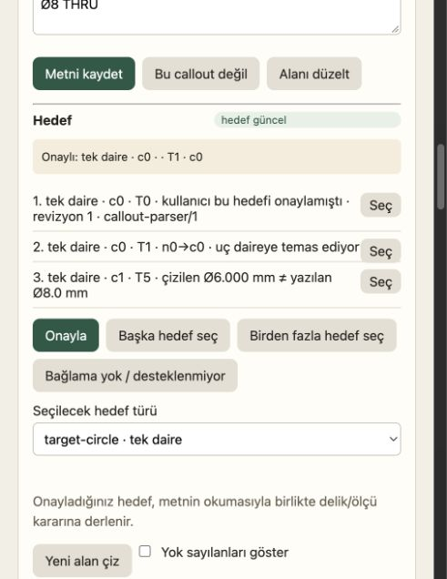

# Bağımsız inceleme — G3R sonrası G4/G5/G6/GX/G7/G8

Tarih: 2026-10-06. İncelenen HEAD: `e51f55521016e742eaee463d931edf966d8e1eeb`.
Karşılaştırma başlangıcı: `2cdb4d0`. İnceleme ürün kodunu veya `PLAN.md` dosyasını değiştirmedi.

**Sonuç:** Önceki G3R bulguları kapanmış. Yeni zincirde dört P1 ve bir P2 bulgu var;
G7/G8'in geometrik doğruluk kabulü henüz verilemez. Ürün kodu, gerçek store/parser/GeneralPlan
yolu ve gerçek tarayıcıyla aşağıdaki somut tekrarlar yapıldı. CAD süreci çalıştırılmadı;
yanlış ölçülerin CAD'e gönderilecek `GeneralPlan` içinde oluştuğu doğrulandı.

## R01 — P1: Dikey ölçüde yön ters; parça geometrisi bozuluyor

**Yer:** `src/drawingto3d/callout_compile.py:65–71`, `_axis_tie` ve linear binding oluşturulması.

Sayfa koordinatında Y aşağı doğru artarken constraint core'un parça koordinatında Y yukarı artar.
`_axis_tie` doğrudan sayfa farkının işaretini `Binding.direction` yapıyor; onaylı view dönüşümünü
ve mevcut eksen/yön karar sözleşmesini kullanmıyor.

Gerçek store üzerinden: 50×30 mm dikdörtgende `(120,20) → (120,80)` dikey kenarına `30 mm`
transcription'ı yazıp iki ucu onayla. Compiler `axis=y, direction=+1` üretir; bu çerçevede doğru
yön `-1`dir. Readiness **true** döner. `make_plan` sağ alt noktayı `(50,0)` yerine `(50,60)`
yapar; planın bounding box'ı **50×60 mm** olur. Aynı fixture'da yatay `50 mm` kontrolü doğru
50×30 mm üretir; sorun zaten bozuk bir başlangıç geometrisine dayanmıyor.

**Düzeltme yönü:** Mevcut onaylı ölçü ekseni/yönü ve görüş dönüşümünü ortak kullan. Sadece
`dy` işaretini ters çevirerek döndürülmüş görüşleri gözden kaçırma. Eksen/yön kararı gerçekten
eksikse bunu açık karar olarak al. İki uç sırası, dikey/yatay ve döndürülmüş görüş regresyonlarını
compiler çıktısından gerçek GeneralPlan koordinatlarına kadar denetle.

Kanıt: [probe-results-before.json](probe-results-before.json), `vertical_30mm` ve
`horizontal_50mm_control` satırları.

## R02 — P1: İnç kör delik derinliği milimetreye dönüştürülmüyor

**Yer:** `src/drawingto3d/callout_compile.py:182–184`, diameter/pocket kararı.

Çap `_size_mm` ile dönüştürülürken derinlik `float(depth)` olarak doğrudan mevcut mm tabanlı
`Hole` kararına yazılıyor. `Ø.5 .25 DEEP in` için gerçek parser `unit=in, depth=.25` üretir.
Hedef onayı ve build hazırlığı geçer; GeneralPlan'da çap **12.7 mm**, derinlik **0.25 mm** olur.
Doğru derinlik **6.35 mm** olmalıdır. Basılı birim yerine kalibrasyondan çözülen `in` ile de
aynı hata tekrarlandı. Bu, yanlış bir parse fixture'ı değil; gerçek parser ve store yolu kullanıldı.

**Düzeltme yönü:** Derinliği de çapla aynı çözülen birim ve provenance üzerinden mm'ye çevir.
Basılı in, sheet in, basılı mm ve birimsiz ret senaryolarını GeneralPlan `hole_0_depth` değerine
kadar test et. Modelde mm üst sınırlarını da dönüşüm sonrasında uygula.

Kanıt: `printed_inch_depth` / `sheet_inch_depth`; ikisinde de `readiness_ready=true` ve
`plan_depth_mm=0.25`.

## R03 — P1: Vurgulanan öneri ile “Onayla”nın kaydettiği hedef farklı

**Yer:** `src/drawingto3d/static/guided.js:391` ve `455–456`.

Öneri etiketine tıklamak `proposalHighlight` ile o hedefi çizimde vurguluyor. Genel **Onayla**
düğmesi bu seçimi kullanmayıp her zaman `proposals[0]` kaydediyor.

Gerçek tarayıcıda, yalnız geçici sentetik oturum kullanıldı:

1. C1 callout'u aç; listede ilk öneri c0, ikinci öneri c1.
2. İkinci önerinin **etiketine** tıkla ve c1'i vurgula (satırın ayrı `Seç` düğmesi değil).
3. Genel **Onayla** düğmesine bas.
4. Panel **“Onaylı: tek daire · c0”** gösterir. Diskteki target da c0; gerçek
   `user/confirm_target` olayı c0 için yazılmıştır. Beklenmeyen console hatası yoktur.

**Düzeltme yönü:** Görüntülenen aktif öneri ile onaylanacak öneriyi aynı state'ten yönet.
İlk öneriyi onaylama ayrı davranış olacaksa düğme bunu açıkça belirtmeli; mevcut “Onayla”
vurgulanan başka hedefi sessizce değiştirmemeli. İkinci/sonraki öneri → highlight → onay →
reload → persisted target eşitliği için tarayıcı regresyonu ekle.

Kanıt: [ui-probe-before.json](ui-probe-before.json), [DOM sonucu](ui-after-dom.txt),
[önceki tam ekran](ui-second-proposal.png).



## R04 — P2: Parse hatası kullanıcıya eksik hedef gibi sunuluyor

**Yer:** `src/drawingto3d/callout_compile.py:137–159`.

Compiler geçerli parse satırını bulmak için önce target'ın parser sürümünü arıyor. Target yoksa
parse bulunmuyor; `missing_target` erken dönüşü `parsed/ambiguous/unsupported` kontrolünden önce.
Bu nedenle henüz hedefi olmayan `M8` için parser `unsupported`, `Ø8 9` için `ambiguous`
demesine rağmen hazırlık ikisinde de **“hedef geometri onaylanmadı” / `confirm_target`** diyor.
Kullanıcı bunu yapmaya çalışınca store parse durumu nedeniyle onayı haklı olarak reddediyor.
Kullanıcı yanlış çözüm adımına gönderiliyor; readiness/audit semantik alanları da boş kalıyor.

**Düzeltme yönü:** Güncel parse'ı transcription revision + beklenen parser sürümünden target'tan
bağımsız seç. Önce parse durumunu/birimini, sonra gerekiyorsa target'ı değerlendir. Desteklenmeyen
metinde `parse_error`, belirsiz metinde `parse_ambiguous` ve metin düzeltme eylemi göster. Bu
testler henüz target bulunmayan gerçek kullanıcı akışını kullanmalı.

Kanıt: `unsupported` / `ambiguous` satırları. Önerilen onayın store tarafından reddedildiği ve
reddin dosyaya yazmadığı da kontrol edildi.

## R05 — P1: Eski dış inceleme paketi değişen geometriye güncel onay yazabiliyor

**Yer:** `src/drawingto3d/callout_review.py:172–200` (`validate_import`),
`src/drawingto3d/guided.py:2045–2065` (`_review_target`).

Export paketinde parser ve geometri sürümü var, ancak import doğrulaması bu iki alanı
karşılaştırmıyor. Hedef onayı mevcut sunucu parser sürümüyle yeniden oluşturuluyor ve güncel
geometri anahtarına pinleniyor. Yalnız `base_revision` kontrolü yetmiyor: mevcut `_migrated`
yolu geometriyi yenilerken karar revision'ını artırmıyor.

Somut tekrar: geometri v3 iken Ø8 THRU/c0 için inceleme paketini dışarı aktar. Aynı geometri
ID'lerini koruyan v4 migration'ında c0 merkezi `(45,45)` yerine `(70,45)` olsun. Gerçek
migration sonrasında base revision hâlâ eşittir; eski paketteki `confirm_target` kabul edilir.
Persist edilen target **geometry_version=4**, yeni **geometry_key**, **state=current** taşır.
İncelemecinin gördüğü bağlam değiştiği halde onayı yeni konuma taşınmış olur.

Bu kontrol gerçek store/export/import/migration yolunu kullanır; geometri üreticisi ve yeni
GEOMETRY_VERSION sentetik olarak sağlandı. Gerçek PDF yeniden okuması iddia edilmez. Ayrı
kontrolde paketin parser başlığı `callout-parser/obsolete` olduğunda da import reddedilmedi;
target sunucunun `callout-parser/1` sürümüyle kaydedildi. Bu ikinci kontrol başlık uyumsuzluğu
testidir, gerçek parser yükseltmesi değildir.

**Düzeltme yönü:** Hedef onayında incelenmiş parser/geometri bağlamını doğrula; eski bağlamı
sunucunun mevcut değerleriyle sessizce değiştirme. Aynı geometri sürümündeki içerik değişimini
de kapsayan bir geometri anahtarını pakete taşı ve karşılaştır. Uyuşmazlıkta import tamamıyla
reddedilmeli, import öncesi kayıt değişmemeli ve yeniden export/review istenmeli. Migration'ın
kendi meşru yazısını import reddinin yazmama kontrolünden ayrı tut.

Kanıt: [import-probe-results-before.json](import-probe-results-before.json),
[tekrar scripti](import_review_probes.py). Güncel paket kontrolünde import kabul edildi;
ardından undo kararları **aynen** geri getirdi ve global revision arttı. Bu undo akışında yeni
bir gerileme görülmedi. Eski parser ve migration sonrası eski geometri kontrolleri başarısız.

## Doğrulama kapsamı

| Kontrol | Bağımsız sonuç |
|---|---|
| 11 odak test dosyası | 385 passed, 2 errors / 2.54 s; errors yalnız sandbox localhost bind engeli |
| Aynı iki HTTP testi localhost izniyle | 2 passed / 1.30 s / exit 0 |
| Mevcut testlerden toplam | **387 farklı test geçti**, iki koşunun birleşimi |
| Önceki G3R store/public tekrarları | 7/7, exit 0 |
| Önceki G3R gerçek HTTP tekrarı | 1/1, exit 0 |
| Önceki G1 / kısa uç tekrarları | 2/2 ve 5/5, exit 0 |
| Yeni store→GeneralPlan/readiness kontrolleri | Yatay kontrol geçti; **5 ihlal**, exit 1 |
| Yeni gerçek tarayıcı kontrolü | Vurgulanan c1 yerine c0 kalıcı onaylandı; **FAIL** |
| Ek import/undo kontrolleri | Güncel import + undo geçti; eski parser ve geometri için **2 ihlal**, exit 1 |

Tam komutlar: [review-metadata.json](review-metadata.json).
Loglar: [focused.log](focused.log), [http-recheck.log](http-recheck.log).
Önceki bulgular: [g3r-recheck.json](g3r-recheck.json), [g3r-http-recheck.json](g3r-http-recheck.json),
[g1-recheck.json](g1-recheck.json), [endpoint-recheck.json](endpoint-recheck.json).

Hermes'in `1387 passed, 339 deselected` raporu bağımsız tam koşu gibi kullanılmadı. Bu tur 26
dakikalık geniş takım, gerçek CAD/STEP üretimi ve 10 çizim kabulü yeniden yapılmadı. Mevcut
`test_planner.py` odak koşuda yeşil; önceki bilinen planner pini düzeltilmiş.

Tekrar:

```sh
PYTHONPATH=src .venv/bin/python eval/audits/20261006-guided-g4-g8-independent-review/review_probes.py
PYTHONPATH=src .venv/bin/python eval/audits/20261006-guided-g4-g8-independent-review/import_review_probes.py
```

UI için [ui_fixture_server.py](ui_fixture_server.py) gerçek Handler ve guided UI'ı geçici
sentetik store ile localhost'ta açar, adresi stdout'a basar. Yukarıdaki dört adımı gerçek
tarayıcıyla izle. Model/PDF ingestion/CAD çağrısı yok. İncelemede açılan sekme/sunucu kapatıldı;
mevcut kullanıcı oturumlarına dokunulmadı.

Ürün kodu ve PLAN.md korunmuştur. Yalnız bu inceleme dizininde script, rapor, log ve görsel
kanıt eklendi; kullanıcıya ait `PLAN-17-HERMES.md` aynen kaldı. Yeni sonuçları `*-after` olarak
yaz; buradaki `*-before` kanıtlarını ezme.
