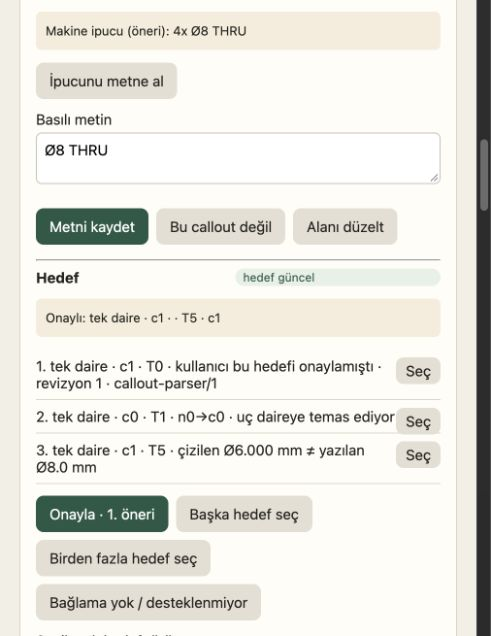

# R01–R05 düzeltmelerinin bağımsız kontrolü

Tarih: 2026-10-07. HEAD: `e51f55521016e742eaee463d931edf966d8e1eeb`.
İncelenen düzeltmeler henüz commit edilmemiş: 4 ürün dosyası, 5 test/fixture dosyası.
İncelenen diff'in kopyası ve SHA-256 değeri bu dizindeki metadata ile kayıtlıdır.

**Sonuç: Önceki beş bulgu, kontrol edilen kapsamda kapanmış. Bu düzeltmelerde yeni,
tekrarlanabilir bir hata bulmadım.** Kod incelemesi, bağımsız tekrar scriptleri ve gerçek
tarayıcı kontrolü yapıldı. Bu sonuç tüm ürünün veya tüm CAD çıktılarının kabulü değildir.

## Bulgu bazında sonuç

| Bulgu | Bağımsız doğrulama | Sonuç |
|---|---|---|
| R01 — dikey ölçü yönü | Yön `-1`, gerçek GeneralPlan bbox 50×30 mm. Ayrıca 30°, 90°, 180°, 270° dönüşlerin her birinde dört kenar ve iki uç sırası: 32/32. Tüm kenar vektörleri doğru; girdi kaydı değişmiyor. | Kapandı |
| R02 — inç kör delik derinliği | Basılı inç ve kalibrasyondan çözülen inç yollarında çap 12.7 mm, GeneralPlan derinliği 6.35 mm. mm kontrolü ve model üst sınırı regresyonları da geçti. | Kapandı |
| R03 — vurgulanan hedef yerine ilkini kaydetme | Gerçek UI'da ikinci öneri c1 etiketine tıklandı. Düğme “Onayla · 2. öneri” oldu; onay c1 olarak diske yazıldı. Reload sonrası panel ve kayıt c1; console hata/uyarı listesi boş. | Kapandı |
| R04 — parse hatasına yanlış çözüm adımı | M8 → parse_error; Ø8 9 → parse_ambiguous. Sorular metni düzeltmeyi istiyor; geçersiz hedef onayı yazmadan reddediliyor. | Kapandı |
| R05 — eski paketin yeni bağlama onay yazması | Eski parser başlığı ve geometri migration'ı sonrası paket reddediliyor; import yazmıyor. Ek olarak aynı geometry_version ve revision korunup c0 konumu değiştirildiğinde geometry_key kontrolü reddediyor. Güncel paket + undo kontrolü geçiyor. | Kapandı |

R03 fixture'ında önceden var olan elle girilmiş delik kararıyla callout ölçüsü çeliştiğinden
readiness `callout_conflict` göstermeye devam eder; bu beklenen korumadır. Testin kabul
ölçütü vurgulanan hedefin aynen kaydedilmesidir, bu fixture'dan üretim yapılması değildir.

## Bu tur gerçekten çalıştırılan doğrulamalar

| Koşu | Sonuç |
|---|---|
| 12 mevcut test dosyası | 412 passed, 2 errors, 4.24 s; iki hata yalnız sandbox localhost bind engeli |
| Aynı iki HTTP testi localhost izniyle | 2 passed, 1.41 s, exit 0 |
| Mevcut testlerden toplam | **414 farklı test geçti**, iki koşunun birleşimi |
| Önceki compiler/readiness tekrarları | 6/6, exit 0 |
| Önceki import/undo tekrarları | 3/3, exit 0 |
| Yeni dönüş/uç sırası + aynı sürüm geometri kontrolleri | 33/33, exit 0 |
| Gerçek tarayıcı, ikinci öneri → onay → reload | Geçti; kalıcı target c1 |
| git diff --check | Temiz |

Komutlar ve inceleme kimliği: [metadata.json](metadata.json).
Test çıktıları: [focused.log](focused.log), [http-recheck.log](http-recheck.log).
Tekrar kanıtları: [compiler/readiness](probe-results.json), [import/undo](import-probe-results.json),
[ek sınır kontrolleri](edge-results.json), [tarayıcı ve kalıcı kayıt](ui-result.json).

## Sınırlar ve teslim durumu

- Kontroller sentetik çizim/oturumlar kullanır. Parser, store, migration, import, compiler,
  GeneralPlan ve UI yolları gerçektir; migration senaryosunda geometri üreticisi simüle edilir.
- Gerçek CAD/STEP üretimi, geniş SEMREAD takımı ve tüm repository testleri bu tur çalıştırılmadı.
  Hermes'in FIX-REPORT içindeki diğer koşuları bağımsız çalıştırılmış gibi sayılmadı.
- Ürün/test kodu, mevcut planlar ve eski kanıtlar değiştirilmedi. Bu tur yalnız bu yeni
  denetim dizini eklendi. Geçici test sekmesi ve sunucusu kapatıldı; kullanıcı oturumlarına dokunulmadı.
- Düzeltmeler çalışma ağacında; commit/push yapılmadı. R01–R05 düzeltme turunun teslimi için
  bu doğrulama kaydıyla birlikte commit edilmesi uygundur. Sonraki aşama kabulü ayrı kapsamdır.
