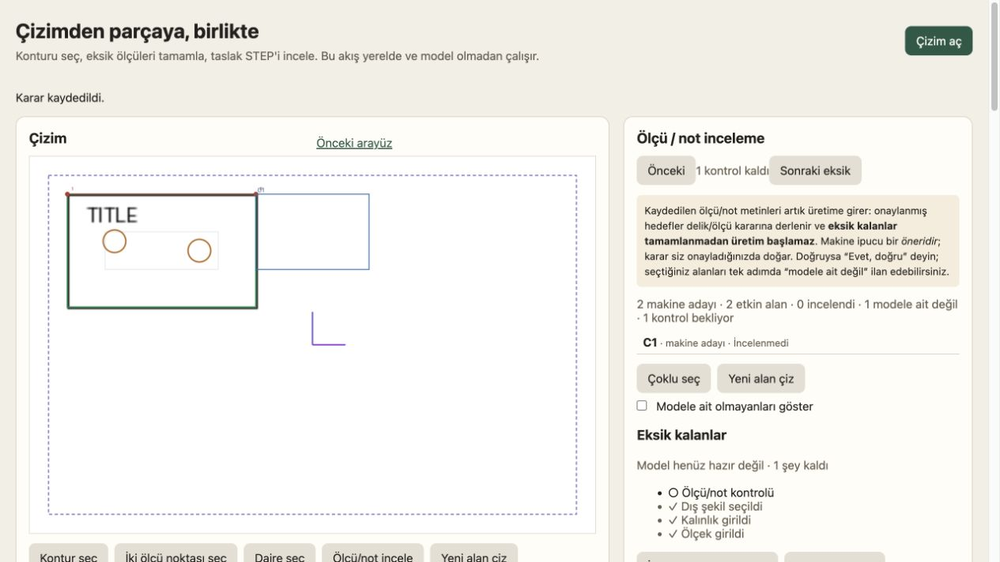

# G9 / UX-01 / G11 bağımsız inceleme

Tarih: 2026-10-07. İncelenen HEAD: `0ff46a8` (tam kimlik metadata.json'da).
Karşılaştırma: `c229672..HEAD`. Başlangıç çalışma ağacı temizdi.

**Sonuç: Plate/G9 geometrisini doğruladım. G11 bir başarı kabulü değildir: sabit kümedeki
9 full_step vakasının yalnız 1'i doğru STEP üretmiş (%11,1). Yeni turda iki P1 ve üç P2
bulgu var.** Bunların dördü koşu/raporlama, biri gerçek kullanıcı arayüzü hatasıdır.
Mevcut raporun yanlış geometri sonuçlarını sakladığı iddia edilmiyor; ancak ana metriği,
girdi doğruluğu ve başarısız vaka kanıtları düzeltilmeden G12 kök nedenleri güvenilir ayrılamaz.

## G11R-01 — P1: Ana başarı metriğinde başarısız full_step vakaları paydadan düşüyor

Yer: `eval/audits/20261007-guided-g11/g11_report.py:74–77`.

Donmuş DELIVERY-PLAN.md:41–42 açıkça `correct full_step / full_step` tanımlar; manifestte
9 full_step ve 1 referanssız vaka var. Rapor ise yalnız geometric verdict alabilen 6 vakayı
sayıyor. Exercise-17, Exercise-13 ve my-part üretime ulaşamadığı için paydadan çıkıyor.
Bu kayıtlarla doğru sonuç **1/9 = %11,11**; yayımlanan **1/6 = %16,67** yalnız üretilmiş
STEP'ler arasındaki koşullu başarıdır ve ana metrik olarak kullanılamaz.

Düzeltme: payda manifestteki sabit full_step kümesi olmalı; çıktı/verdict yokluğu bu kümeden
vaka çıkarmamalı. Koşullu oran istenirse ayrı adla verilmeli. Build/evaluator hatası olan ve
bekleyen vakaları içeren rapor regresyonu eklenmeli; manifest kapsamı değiştirilmemeli.
Kanıt: [report-audit.json](report-audit.json), [case-audit.json](case-audit.json).

## G11R-02 — P1: Flange reçetesi doğrulanmamış ölçüyü ilgisiz uçlara kesin kalibrasyon yapıyor

Yer: `eval/audits/20261007-guided-g11/recipes-official/flange-raster.json:5`,
`recipes-resume/flange-raster.json:7–13`; uygulama yolu `g11_runner.py:250–268`.

Reçete OCR'nin `90.00` ölçüsünü g385–g386 merkezleri arasına bağlamış; kendi notu bunun
belirsiz bir “deneme” olduğunu söylüyor. Kaydedilmiş karar ise normal kesin kalibrasyon:
`first=[900.75,1476.75]`, `second=[1077.75,1584.75]`, `value=90`, `unit=mm`, `span_id=t4`.

Kaynak Flange.PNG'yi bağımsız görsel olarak inceledim. t4'ün
`bbox={x:1848,y:731,w:134,h:42}` alanındaki basılı ölçü **50.00** ve kesit görünüşünün
yatay boyudur. Ön görünüşte seçilen iki daire merkezinin mesafesi değildir. Reçetedeki
“en uzun basılı açıklık” yaklaşımı ne OCR metnini ne de ölçünün uçlarını doğrulamış oluyor.
Bu hatalı ölçek ve seçilen daire, kayıttaki yaklaşık **79.475 mm** diski doğuruyor; mevcut
`CAD_WRONG` etiketi bunu ürünün CAD yeteneğinden ayırmıyor. Case JSON `notes=[]` olduğu için
reçetedeki belirsizlik sonuca da taşınmamış.

Düzeltme: kalibrasyon metninin çizimde doğrulandığını ve bağlandığı uçları ölçtüğünü kanıtla;
kanıt yoksa ilgili okuma/bağ/ölçek hatasıyla durdur. Belirsiz “deneme” değerlerini resmî
kesin karar olarak kullanma. Reçete gerekçelerini ve kimliğini vaka kaydına taşı. Exercise-51
reçetesindeki benzer “40 ve g340–g341 denendi” yolu da bu ölçütle yeniden denetlenmeli.
Eski sonuçları silmeden düzeltilmiş girdilerle yeni run kaydı üret.

Kanıt: [flange-input-audit.json](flange-input-audit.json),
[kaynak çizim](</Users/aydemir/Desktop/drawingto3d/examples/pdf with steps/8/Flange.PNG>).
Kaynak STEP bu girdi kontrolünde kullanılmadı.

## G11R-03 — P2: “Bu bir ölçü/not değil” sonrasında otomatik ilerleme çalışmıyor

Yer: `src/drawingto3d/static/guided.js:229–230`, `173`, `363`.

Varsayılan durumda yok sayılanlar gizli. Başarılı `set_ignored` sonrası `busy(false)` önce
render çalıştırıyor; artık görünmeyen seçili satırı `selectedCallout=null` yapıyor.
Ardından `advanceAfterDecision(previousId)` içindeki seçim eşitliği kontrolü erken dönüyor.

Gerçek tarayıcıda iki adaylı geçici oturum: ilk TITLE alanını aç → “Bu bir ölçü/not değil” →
kayıt revision 1, ilk alan ignored, **“1 kontrol kaldı”**, ancak **seçili satır 0** ve detay
paneli gizli. Beklenen ikinci alanın otomatik açılması. Elle “Sonraki eksik” tıklanınca
ikinci alan (`Ø8 THRU`) açılıyor; sorun ikinci alanın bulunamaması değil.

Düzeltme: filtrelenmeden önceki sıra/seçim kimliğiyle ilerlemeyi hesapla; kullanıcının başka
alana geçmesini koruyan kontrolü kaybetme. Hem ignore düğmesini hem ipucu-ignore düğmesini,
yok sayılanları göster açık/kapalı durumlarını ve son açık satırı tarayıcıda test et.
Mevcut kabul sürücüsü otomatik ilerlemeyi unbindable ile sınamış, bu yolu kapsamıyor.

Kanıt: [ui-ignore-result.json](ui-ignore-result.json), [DOM](ui-ignore-dom.txt),
[elle ilerleme kontrolü](ui-manual-next-dom.txt), [tekrar sunucusu](ui_fixture_server.py).

## G11R-04 — P2: STEP üretilemeyen vakaların oturum ve inceleme kanıtı kaydedilmiyor

Yer: `eval/audits/20261007-guided-g11/g11_runner.py:455–473`.

`session-public.json` ve `review-bundle.json` yazımı `if final.get('step')` içine konmuş.
Exercise-17, Exercise-13, my-part ve referanssız elbow kayıtlarında `artifacts={}`. Bu
vakalar tam da kararların, metinlerin, hazırlık durumunun ve sunucu build hatasının gerekli
olduğu başarısız vakalar. Örneğin Exercise-13 yalnız “build did not produce a STEP” ve HTTP
400 kaydı taşıyor; build yanıtının asıl hata metni ve oturumun son hali teslimde yok.

Düzeltme: her vaka sonunda başarıdan bağımsız olarak son session, export bundle, readiness,
oturum token'ı, reçete kimliği ve hata yanıtını kaydet. Yalnız STEP/plan indirmesi gerçek build
varlığına bağlı kalsın. Sonradan kurtarılan kanıtları kurtarma zamanı ve kaynağıyla etiketle;
koşu anında kaydedilmiş gibi sunma. Kanıt: [report-audit.json](report-audit.json).

## G11R-05 — P2: Tarayıcı hataları evaluator hatası diye sınıflandırılıyor

Yer: `eval/audits/20261007-guided-g11/g11_runner.py:480–484`.

Her console/network hatası doğrudan `EVALUATOR` oluyor. Resmî rapordaki dört EVALUATOR kaydı
bu bloktan: flange ve my-part için yalnız favicon 404; exercise-17/13 için build HTTP 400
(bazılarında ayrıca favicon). Bunlar CAD değerlendiricisinin çalışmadığını veya çöktüğünü
göstermiyor. Flange'in gerçek evaluator'ı başarıyla çalışıp yanlış geometri verdict'i vermiş.
Bu sınıflama G12'yi olmayan dört evaluator hatasına yönlendirir.

Düzeltme: evaluator etiketi yalnız evaluator süreci/parsing/karşılaştırma arızaları için
kullanılmalı. Build 400'ün gövdesini alıp kök nedenine göre sınıflandır; favicon gibi yardımcı
kaynak hatalarını ayrı UI telemetrisi olarak sakla. Kanıt: [report-audit.json](report-audit.json).

## Bağımsız doğrulama

| Kontrol | Sonuç |
|---|---|
| Callout + guided mevcut testleri | 483 passed, 1 failed, 12 errors / 123.63 s; 13'ü de sandbox localhost bind engeli |
| Aynı 13 HTTP kontrolü izinli tekrar | 13 passed / 7.20 s |
| Mevcut testlerden toplam | **496 farklı test geçti**, iki koşunun birleşimi |
| Kaydedilmiş G9 STEP, donmuş feature evaluator | PASS |
| G9 oturum kararları → mevcut compiler → GeneralPlan → yeni gerçek CAD/STEP | Başarılı; 5 delik/cep, 0 ölçü bağı, 43 kapsam dışı |
| Yeni üretilen G9 STEP, aynı donmuş feature evaluator | PASS |
| G11'de bulunan 6 STEP'i gerçek CAD ile iki kez açıp yeniden karşılaştırma | 1 PASS (Plate), 5 FAIL; kayıtlarla aynı |
| 10 kaynak dosyanın hash'i | Manifestle eşleşiyor |
| Manifestin G10 freeze sonrası değişimi | Yok |
| Tüm vaka HEAD'lerinin src ağacı | Aynı; yalnız ilk/son karşılaştırmasıyla yetinilmedi |
| UX ignore → otomatik ilerleme | FAIL, gerçek tarayıcı; elle ilerleme kontrolü PASS |

G9 bbox **120.011 × 80.002 × 15 mm**, hacim **124812.494 mm³**; donmuş toleranslarla
4 geçişli delik, üstten 8 mm kör cep, köşe yuvarlatmaları ve simetrik fark kontrolleri geçiyor.
Kaydedilmiş STEP doğrulamasına ek olarak mevcut kodla eski oturum kararlarından yeni çıktı
üretildi; bu tekrar yeni upload/insan kararı/UI kabulü olarak sunulmuyor.

Loglar: [focused.log](focused.log), [http-recheck.log](http-recheck.log),
[Plate kontrolü](plate-regression.log), [yeniden üretim](plate-rebuild.log),
[yeni STEP kontrolü](plate-rebuild-verdict.json), [G11 STEP karşılaştırmaları](step-recheck.json).
Tam komut/kapsam: [metadata.json](metadata.json).

Bu tur 10 çizimin uzun ingest/tarayıcı koşusu ve tüm repository/SEMREAD testleri yeniden
çalıştırılmadı. Ürün kodu, mevcut raporlar, manifest ve eski kanıtlar değiştirilmedi; yalnız bu
denetim dizini eklendi. Geçici tarayıcı sekmesi/sunucusu kapatıldı. Commit/push yapılmadı.

Önerilen sıra: G11R-01–05 düzeltmeleri ve koşu kanıtlarının tamamlanması → düzeltilmiş girdiyle
gerekli vakaların yeni koşusu → doğru kök nedenlere göre G12. G13 kabulü henüz yok.
